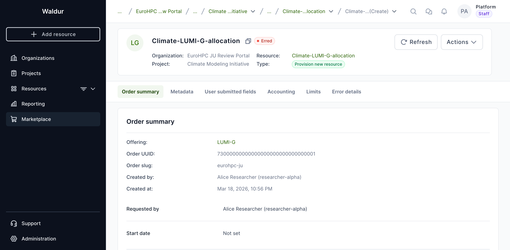
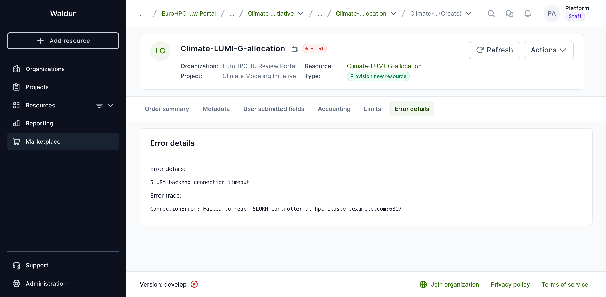
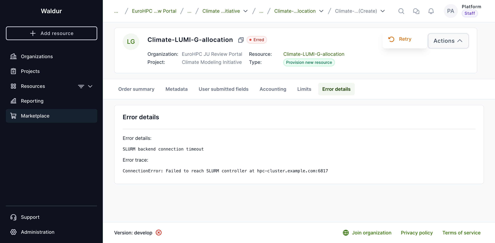
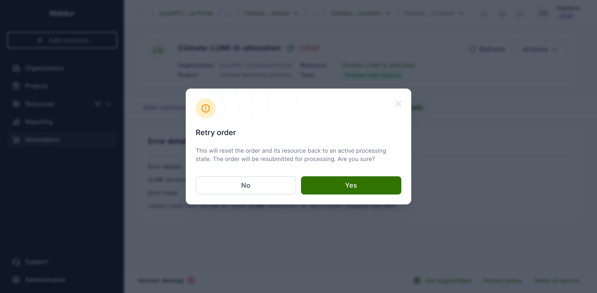
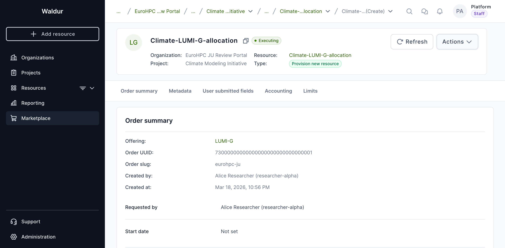
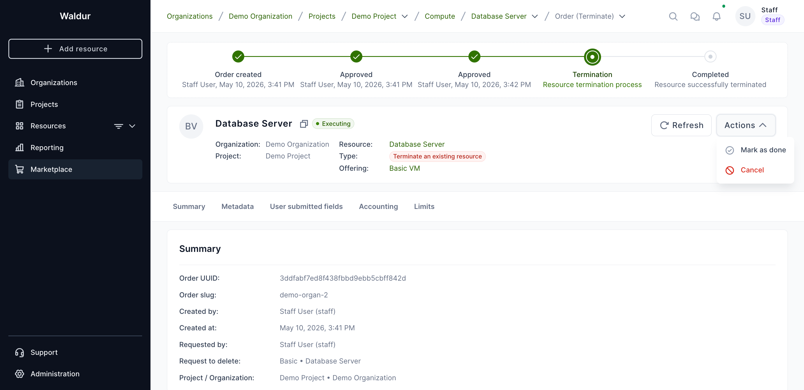
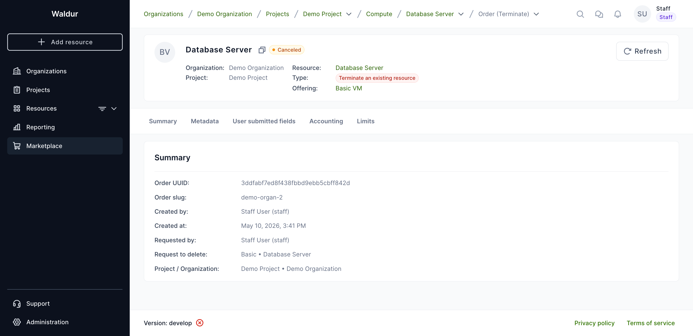
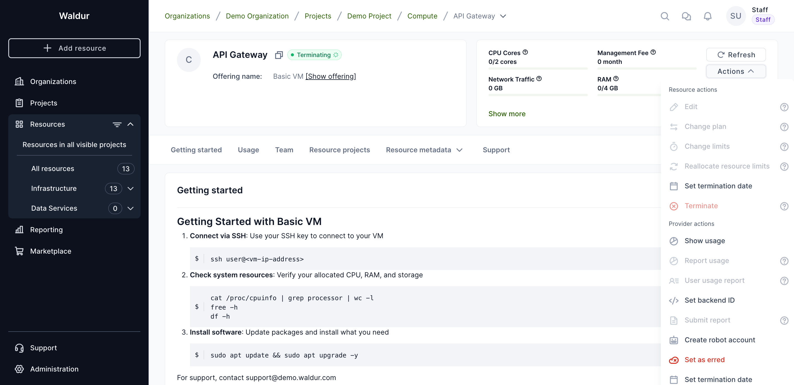
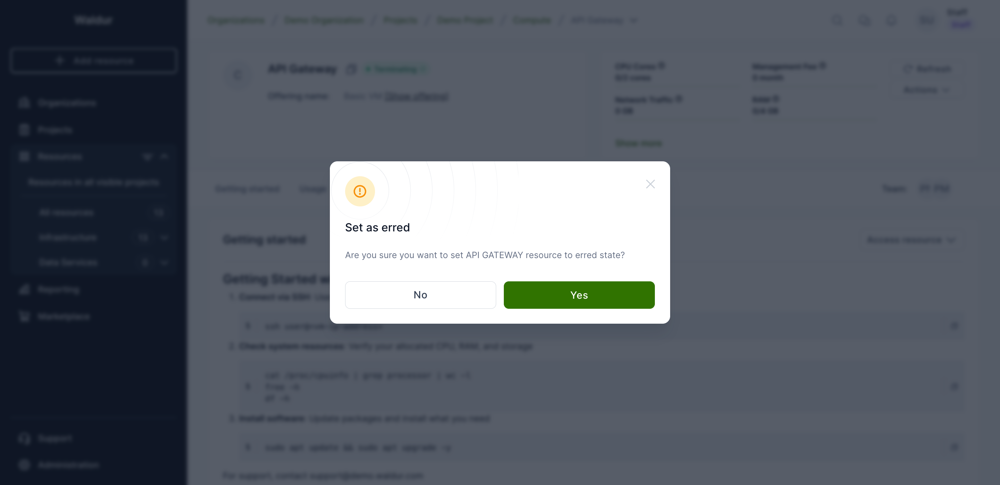

# Order management

When a customer requests a resource from your offering, an order is created and
moves through a fixed state machine — see [Order states](../../about/modules/lifecycle.md#order-states)
for the full diagram and the numeric state codes used by the API.

## Managing orders

As a service provider (organization owner, offering owner, or offering manager), you can manage orders for your offerings from the **Provider** dashboard under the **Orders** section.

### Approving and rejecting orders

When an order is in **Pending provider** state, you can:

- **Approve** the order to start resource provisioning
- **Reject** the order with a reason that will be communicated to the customer

### Marking orders as done

For offerings that are managed manually (Basic and SLURM offerings), you can mark an executing order as **Done** once the resource has been provisioned on the backend.

### Retrying erred orders

When an order fails during processing, it enters the **Erred** state. If the failure was caused by a transient issue (e.g., temporary backend unavailability, network timeout), authorized users can retry the order instead of asking the customer to create a new one.

#### Who can retry

- Platform staff
- Organization owners of the service provider
- Offering managers

#### How to retry

1. Navigate to the order details page. The order state will show as **Erred** with an error message describing what went wrong.

    

2. Click the **Error details** tab to review what went wrong before retrying.

    

3. Click the **Actions** dropdown button and select **Retry**.

    

4. A confirmation dialog will appear explaining that the order and its resource will be reset to an active processing state. Click **Yes** to confirm.

    

5. After confirming, the order transitions back to **Executing** and a success notification appears.

    

!!! warning
    Retrying an order clears the previous error message and traceback. If you need to preserve error details for investigation, note them down before retrying.

!!! note
    Retry is currently supported for **Basic** and **SLURM** (site agent) offering types. Other offering types do not support this action.

#### What happens during retry

| Order type | Resource state after retry |
|------------|---------------------------|
| Create | Creating |
| Update | Updating |
| Terminate | Terminating |

The order's error message, error traceback, and completion timestamp are cleared. The order is then resubmitted for processing through the normal provisioning pipeline.

### Cancelling an order

An order that has been submitted but is still in flight can be cancelled before it completes. Cancellation aborts the order and, for **Terminate** orders, restores the affected resource to the **OK** state via the cancellation callback.

#### Who can cancel

- Platform staff
- Organization owners and project managers of the consumer (project / project.customer scope)

#### When the Cancel action is available

| Condition | Required value |
|-----------|----------------|
| Offering type | **Basic** or **Support** |
| Order state | **Pending consumer**, **Pending provider**, **Pending start date**, or **Executing** |

For other offering types (OpenStack, SLURM, Rancher, Script, Remote), the order-level cancel action is not exposed — see [Recovering a resource stuck in Terminating](#recovering-a-resource-stuck-in-terminating) below.

#### How to cancel

1. Open the order details page from the resource, the orders list, or the confirmation drawer.
2. Click the **Actions** dropdown and select **Cancel**.

    

3. The order is cancelled immediately and a *Order has been canceled.* notification is shown. The order state becomes **Canceled**.

    

!!! note
    Cancelling a Terminate order automatically returns the underlying resource to the **OK** state. No manual recovery step is needed.

#### Cancelling a Terminate order on a Remote offering

For **Remote** (federated) offerings, a separate staff-only action is exposed in the orders table on the resource page. It is visible only when:

- The user is platform staff.
- The order type is **Terminate**.
- The order is in **Executing** state.

The action calls the remote Waldur instance to abort the in-progress termination.

## Recovering a resource stuck in Terminating

If a backend never confirms a termination (provider system unreachable, site agent offline, processor crash), the marketplace resource can remain in the **Terminating** state indefinitely. Service-provider users have two recovery actions on the resource detail page.

### What you see

Open the resource details page and click **Actions**. For a resource in **Terminating** state, the **Provider actions** section exposes **Set as erred**. The standard **Resource actions** (Edit, Terminate, ...) are still listed but most operations cannot be re-issued until the resource leaves the Terminating state.



### Set as erred

Use this when the underlying backend operation has failed and the consumer should see a clear error.

1. Click **Actions → Set as erred** in the Provider actions section.
2. Confirm the dialog.

    

3. The resource transitions to **Erred**. The associated terminate order remains in its current state — review and reconcile it manually if needed.

!!! warning
    "Set as erred" is a state override, not a backend operation. The resource still exists on the provider side if the original termination request did not actually run. Verify the backend before declaring the resource removed.

### Marking the resource OK from API

The backend also accepts a direct *set state OK* call (`POST /api/marketplace-resources/{uuid}/set_state_ok/`) which transitions the resource from **Terminating** back to **OK**. This endpoint is currently exposed in HomePort only on legacy OpenStack-native detail pages — for marketplace resources of other types, staff need to call the API directly:

```bash
curl -X POST \
  -H "Authorization: Token <token>" \
  https://<waldur>/api/marketplace-resources/<uuid>/set_state_ok/
```

The caller must hold the `SET_RESOURCE_STATE` permission on the offering's customer (service-provider scope) or be platform staff.

### Force destroy (staff escape hatch)

When a Terminate order has already been retried and the backend cannot confirm deletion, platform staff can submit a Terminate order with `attributes.action="force_destroy"`. On processor failure the resource jumps directly to **Terminated** instead of **Erred**, and any provider-side cleanup is skipped. There is no UI for this — it is API-only:

```bash
curl -X POST \
  -H "Authorization: Token <token>" \
  -H "Content-Type: application/json" \
  -d '{"attributes": {"action": "force_destroy"}}' \
  https://<waldur>/api/marketplace-resources/<uuid>/terminate/
```

!!! danger
    `force_destroy` bypasses backend cleanup. Use only when the resource is known to be already gone on the provider side and Waldur has been left with stale state.

## Cancellation paths by offering type

The table below summarises which recovery action is exposed in HomePort for each offering type when a resource is stuck in Terminating.

| Offering type | Cancel order (consumer) | Cancel termination (staff) | Set as erred (provider) | Set state OK |
|---|:---:|:---:|:---:|:---:|
| Basic | Yes | — | Yes | API only |
| Support | Yes | — | Yes | API only |
| Remote | — | Yes (staff) | Yes | API only |
| OpenStack | — | — | Yes | API only |
| SLURM | — | — | Yes | API only |
| Rancher | — | — | Yes | API only |
| Script | — | — | Yes | API only |
