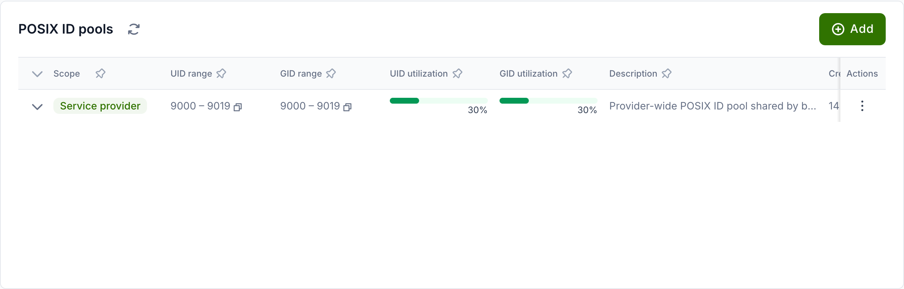
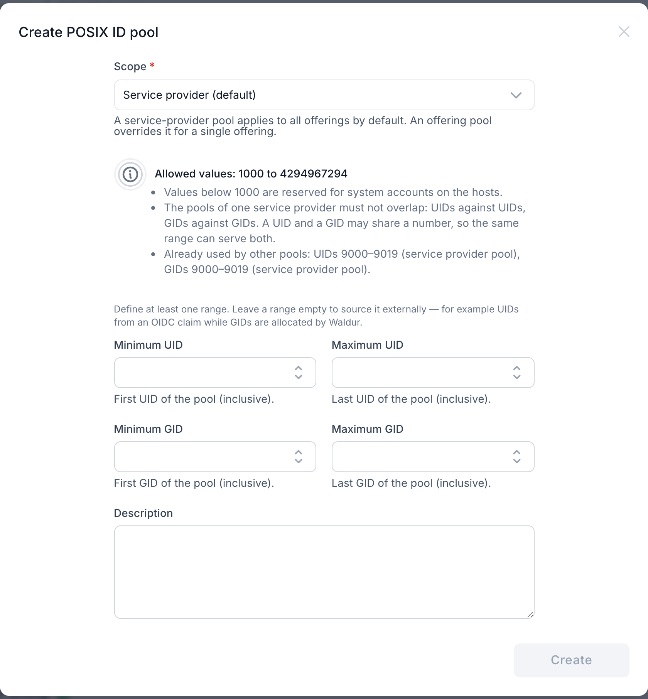
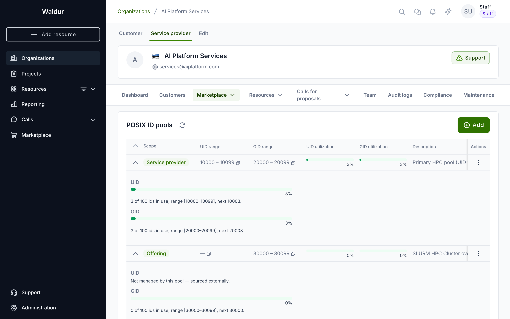
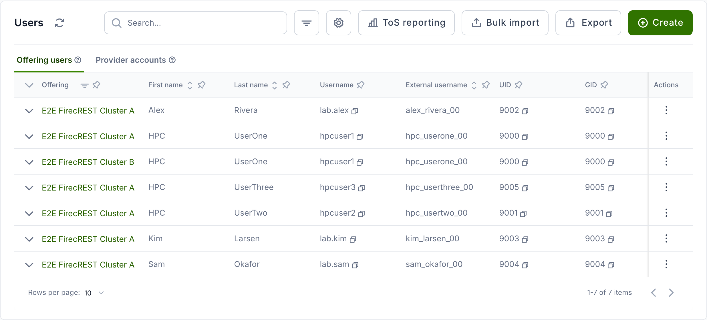
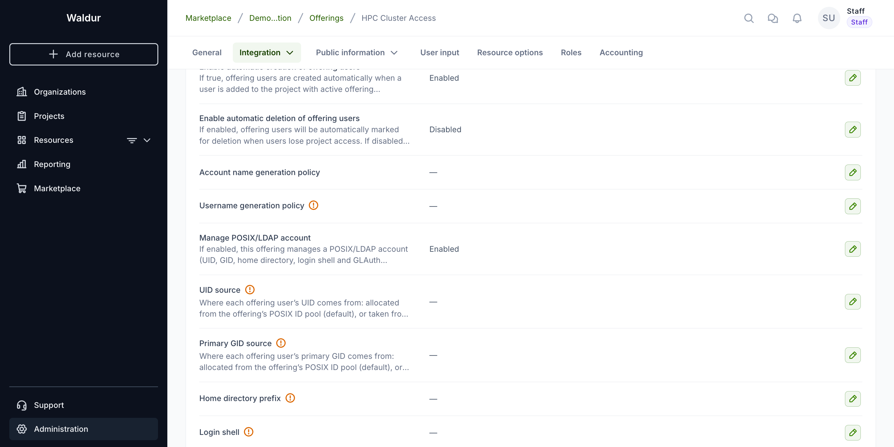

# Managing POSIX ID pools

Linux and HPC offerings provision local accounts and groups for their users —
for example through GLAuth (LDAP) and the Waldur site agent that feeds SLURM
clusters. Each such account needs a numeric POSIX **UID** (user id) and
**GID** (group id). A POSIX ID pool lets a service provider reserve the number
blocks Waldur allocates from, so that user and group identifiers stay unique
and predictable across all of the provider's offerings.

!!! note
    POSIX ID pools are how Waldur allocates UIDs and GIDs — an offering only
    hands out identifiers when a pool resolves for it. If you do not see the
    **POSIX ID pools** menu under your provider workspace, ask the platform
    operator to make it visible (the `marketplace.show_posix_id_pools` feature
    flag).

## How a pool works

A pool holds **two independent number ranges** — one for UIDs and one for GIDs —
each defined by a minimum and a maximum. UIDs and GIDs are separate namespaces,
so a UID and a GID may share the same number, but no two accounts ever share a
UID, and no two groups ever share a GID.

A pool must define **at least one** of the two ranges, but either may be left
empty to source that identifier **externally** instead of from the pool. The
common case is a federated deployment where each user's UID is a property of
their identity (delivered as an OIDC/SAML `uidNumber` claim and the same on every
site), while project and role **GIDs** are allocated per provider by Waldur: give
such an offering a **GID-only** pool (leave the UID range empty) and set its
UID source to the user attribute (see
[GLAuth user accounts → sourcing UID/GID](glauth-user-accounts.md#sourcing-uid-and-gid)).
Pairing a GID-only pool with externally-sourced UIDs guarantees a Waldur-allocated
UID can never collide with the identity provider's.

A pool is attached to one of two scopes:

| Scope | Use it when… |
|-------|--------------|
| **Service provider** (default) | One identifier space shared by all of your offerings. Most providers need only this. |
| **Offering** (override) | A single offering needs its own isolated number space — for example a separate cluster with its own LDAP directory. |

When Waldur needs an identifier for an offering, it uses the offering's own pool
if one is defined, otherwise the service-provider pool. If neither resolves, the
affected accounts are left without a UID/GID and are excluded from the GLAuth
output until a pool is configured.

## Creating a pool

1. Open your provider workspace, go to **Marketplace → POSIX ID pools** and
    click **Add**.

    

2. Choose the **Scope**. Keep **Service provider (default)** for a provider-wide
    pool, or pick **Offering (override)** and select the offering for an
    isolated per-offering pool.

3. Enter the **Minimum** and **Maximum** for the **UID** and/or the **GID**
    range (all inclusive). Define at least one range; leave a range empty only
    when that identifier is sourced externally (see the note above). Each range
    is all-or-nothing — set both its bounds or neither. Optionally add a
    description, and click **Create**.

    

!!! warning "Pools of one provider may not overlap within a namespace"
    Across a provider's pools, UID ranges must not overlap each other and GID
    ranges must not overlap each other — one provider is treated as one POSIX
    identifier space per namespace. A UID range *may* share numbers with a GID
    range (the two namespaces are independent). If you try to save an
    overlapping pool, Waldur rejects it and names the conflicting pool, so an
    offering override must use a number band disjoint from the provider default
    (for example provider UIDs `100000–199999`, an isolated offering's UIDs
    `300000–399999`).

## Which pool applies to an offering

Resolution is simple: an offering uses its **own** pool if it has one, otherwise
the **service-provider** pool. To check, open the offering and go to **Edit →
Integration → User management** — the panel shows the pool in effect for that
offering, with a link to manage the provider's pools.

## Monitoring utilisation

The pools list shows the UID and GID utilisation of every pool at a glance.
Expand a pool row for the full per-namespace breakdown — capacity, the number of
identifiers in use, and the next value the allocator will hand out for each
namespace. A namespace that the pool does not manage (an empty range) is shown
as **Not managed by this pool — sourced externally** rather than a utilisation
bar.

The utilisation bar turns amber as a namespace fills and red once it crosses the
threshold (90% by default), so you can widen the range before it runs out. An
exhausted namespace stops account creation with a clear error until more numbers
are available.

## How identifiers are assigned

Identifiers are handed out sequentially from the resolved pool as offering
users, robot accounts and groups are created — a high-water mark advances per
namespace. The assigned values are stored on each account, so you can review the
**UID** and **GID** in the provider's **Offering users** list.

When an offering user or group is deleted, its identifiers are **released** and
recycled automatically: the next account created from the same pool reuses the
lowest released value before the high-water mark advances further. Released
records are kept as an audit trail and are visible in a pool's **identities**
view.

## Where an identifier came from

Expanding an offering user shows a **POSIX identifiers** table listing each of
that account's identifiers together with the **pool scope** it was allocated
from. Some rows show a dash instead of a scope. That is not an error: it means
the value is not tracked by any pool.

A value ends up untracked in one of three ways:

- **It is sourced from a user attribute.** When the offering's `uid_source` or
  `gid_source` is set to `user_attribute`, the identifier is taken from the
  Waldur user's own `uid_number` / `primary_gid` — typically populated from an
  identity-provider claim — rather than allocated. No pool is involved, so a
  dash is the expected display. See
  [sourcing UID and GID](glauth-user-accounts.md#sourcing-uid-and-gid).
- **It predates POSIX ID pools** and was not picked up when the deployment was
  upgraded.
- **It was seeded directly**, for example by a structure import or straight into
  the database.

!!! warning "Untracked values are not reserved"
    An identifier the allocator does not know about is outside its bookkeeping,
    so nothing prevents the same number later being handed to another account
    from a pool whose range covers it. Where that matters, bring the value under
    a pool — see [legacy identifiers](#legacy-identifiers-outside-a-pool) below.

Upgrading an existing deployment does not, by itself, leave values untracked.
The migration that introduces pools synthesises one pool per offering with its
bounds **widened to cover every identifier already in use**, and records each of
those identifiers, so values that existed at upgrade time end up inside a pool.

## Pinning specific UIDs/GIDs

Sometimes an account must keep a **specific** UID or GID — for example to match
an identity that already exists on the backend. Set it from **Edit POSIX
attributes** on the offering user (see
[Per-user overrides](glauth-user-accounts.md#per-user-overrides)). The value
must fall **within the offering's pool** and must not already be in use; the
allocator then skips it when handing out sequential numbers, so a pinned value
never collides with an automatically assigned one.

!!! note
    Valid POSIX ids run from `1000` (below is reserved for system accounts) to
    `4294967294`. If an offering needs a number band entirely separate from the
    provider default — for instance a block reserved for manually pinned
    identities — give that offering its own **offering-override pool** rather
    than pinning outside the provider pool's range.

A pinned value must be **inside** the pool that applies to the offering. Waldur
rejects a value outside that range, and rejects one already held by another
active account, rather than accepting it and letting two accounts collide later.
So "pin an arbitrary number" is not available by design — if the number you need
falls outside every configured range, widen or add a pool first, as described
next.

## Legacy identifiers outside a pool

Sites migrating onto Waldur often arrive with UIDs and GIDs already in use on
the backend, in bands that no configured pool covers. There are two supported
ways to accommodate them; which one fits depends on whether the identifier
belongs to the **site** or to the **identity**.

### The identifiers belong to this site

Give the offering its own **offering-override pool** whose range covers the
legacy band, then pin the individual values inside it (see
[Pinning specific UIDs/GIDs](#pinning-specific-uidsgids)).

This keeps every legacy value under the allocator's bookkeeping, so it is
reserved and can never be reissued. Remember that pools of one provider must not
overlap within a namespace, so the override band has to be disjoint from the
provider default — for example a provider default of `100000–199999` alongside a
legacy offering on `5000–9999`.

### The identifiers belong to the user's identity

If a user's UID is a property of who they are rather than of this site — the
same on every site in a federation, delivered as an OIDC or SAML `uidNumber`
claim — do not try to reproduce it from a pool. Set the offering's `uid_source`
to `user_attribute` and pair it with a **GID-only pool**, as described under
[sourcing UID and GID](glauth-user-accounts.md#sourcing-uid-and-gid). Waldur then
never allocates a UID at all for that offering, so it cannot collide with the
one the identity provider supplies, while project and role GIDs continue to come
from the pool.

Both sources are set on the offering, under **Edit → Integration → User
management**:

The trade-off between the two: an override pool keeps everything visible in one
place and reserved against reuse, but the numbers are this site's to manage. User
attributes keep a user's UID stable across sites, at the cost of those UIDs not
appearing in any pool's utilisation figures — they will show a dash for pool
scope, as described in [where an identifier came from](#where-an-identifier-came-from).
