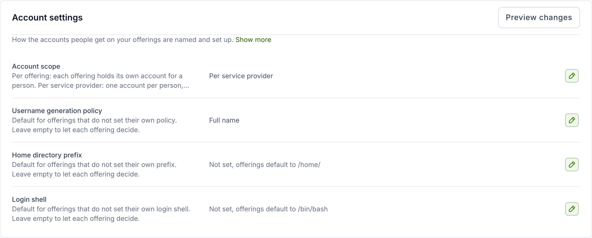
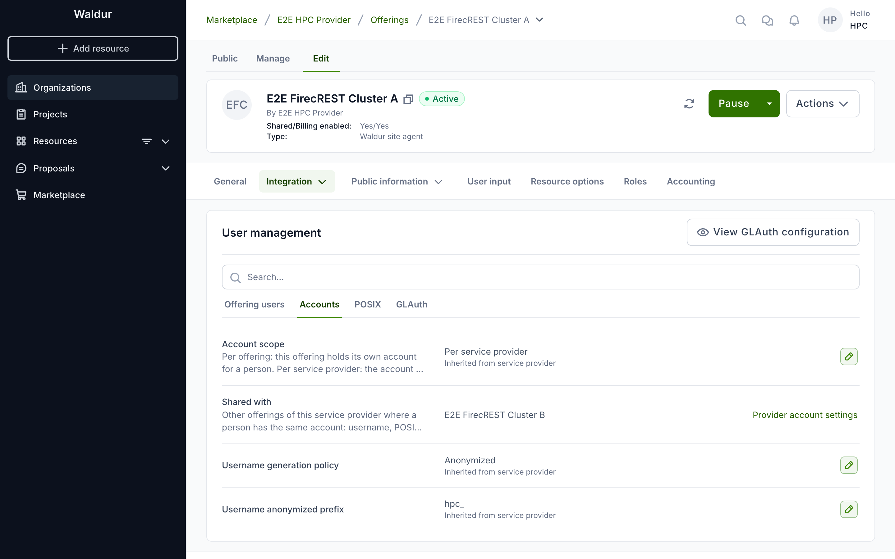

# Shared POSIX identity, step by step

One directory, several SLURM offerings of one provider, and one entry per
person. This page is the ordered checklist for setting that up in Waldur; each
step links to the page that explains it. The agent and cluster side — the site
agent's `ldap` settings, `sssd.conf`, and how to verify with `ldapsearch`,
`getent` and `id` — lives with the agent, on the
[LDAP username management plugin](../../admin-guide/providers/site-agent/plugins/ldap/README.md)
page of the administrator guide.

## Before you start

- Waldur with POSIX ID pools and the provider account pages enabled
  (`marketplace.show_posix_id_pools` and `marketplace.show_provider_accounts`).
  Both are off by default: if the provider workspace has no **Accounts** menu,
  ask the platform operator to enable them.
- A service provider owning every offering that will share the directory.
- An OpenLDAP directory and a site agent host; both are set up on the agent side.

## 1. Set up the service provider

Everything that makes a person *one* identity — the numbers, the scope of the
account and its name — is configured once, on the service provider.

### Attach a POSIX ID pool

The pool is what gives a person one UID and one primary GID across every
offering of the provider. Open the provider's **Accounts → POSIX ID pools** page
and create one with UID and GID ranges that are free in the directory. The form
names the allowed bounds and the ranges your other pools already use.

Details, including how a pool attached to an *offering* overrides the provider's
and why that defeats sharing: [Managing POSIX ID pools](posix-id-pools.md).

### Set the account settings on the service provider

Open the service provider's **Accounts → Account settings** page. It holds the
account settings every offering of the provider inherits; a field left empty
shows the default offerings fall back to. Organization owners and staff can edit
it, and **Preview changes** shows what a change would do to the existing
accounts before it is saved.

| Field | Value | Why |
|---|---|---|
| Account scope | *Per service provider* | Waldur holds one account per person for the whole provider, and every offering user reads its username, UID, primary GID and home directory through it — so the directory entry has exactly one owner in Waldur |
| Username generation policy | *Anonymized* | Waldur names the account, and the name derives from the pool UID — the same on every offering |
| Anonymized username prefix | e.g. `hpc_` | Shown once the policy is *Anonymized*. Left empty, the default `waldur_` applies |
| Home directory prefix | empty, or e.g. `/home/` | Empty lets each offering decide; the default is `/home/` |
| Login shell | empty, or e.g. `/bin/bash` | Empty lets each offering decide; the default is `/bin/bash` |

How the names are formed: [Usernames derived from the pool](posix-id-pools.md#usernames-derived-from-the-pool).
Why one account per person matters for a shared directory:
[One person, one entry](openldap-sssd-accounts.md#one-person-one-entry).

!!! note "Switching an existing provider"
    Changing **Account scope** to *Per service provider* on a provider that
    already has offering users links their existing accounts to one account per
    person. It is refused while a person has different usernames on different
    offerings; make those consistent first. An offering that runs its own
    separate directory can still override the scope back to per offering.

## 2. Set up each offering's user management

Open the offering, then **Edit → Integration → User management**. Its settings
are grouped in tabs — **Offering users**, **Accounts**, **POSIX** and
**GLAuth** — with a search box above them. Only the settings that are genuinely
per offering are set here, with the same values on every offering that shares
the directory:

| Setting | Value | Why |
|---|---|---|
| Enable automatic creation of offering users (**Offering users**) | on | Waldur creates the offering user when a person gains access. The naming and POSIX settings on this form can only be changed while this is on |
| Enable automatic deletion of offering users (**Offering users**) | on | Losing the last project role moves the offering user to *Requested deletion*, which is what makes the agent release the entry |
| Manage POSIX/LDAP account (**POSIX**) | on | Allocates the UID and GID and exposes them to the agent |
| UID source / Primary GID source (**POSIX**) | *POSIX ID pool* (the default) | The values come from the provider's pool rather than from identity attributes |

The account fields — **Account scope**, **Username generation policy** and
**Username anonymized prefix** on the **Accounts** tab, **Home directory
prefix** and **Login shell** on the **POSIX** tab — show the value in effect
and where it comes from: *Inherited from service provider*, or *Default* when
the provider leaves it empty too. The screenshot shows the **Accounts** tab with
nothing set on the offering: the scope, policy and prefix all come from the
provider's Account settings, and **Shared with** names the other offerings a
person's account is shared with. Leave them that way. Set one only when a
single offering really needs a different value: an offering's own value wins
over the provider's, and on a shared directory a different scope, policy or
prefix gives the same person a different account or name on that offering. A
value set on the offering carries a link that removes it again, naming what
the offering then inherits — for example *Use provider setting (Anonymized)*.
The **POSIX** tab also shows the POSIX ID pool the accounts draw from.

What the *UID source* / *Primary GID source* choices mean:
[Legacy identifiers outside a pool](posix-id-pools.md#legacy-identifiers-outside-a-pool).

!!! warning
    All sharing offerings must belong to the **same service provider**: the
    pool, the provider-wide account and the agent's "still active elsewhere?"
    check on departure all span that provider's offerings only.

## 3. Configure the site agent and the cluster nodes

Follow the
[LDAP username management plugin](../../admin-guide/providers/site-agent/plugins/ldap/README.md)
page: one shared `ldap` block with `account_source: waldur`, a project-group GID
range clear of the pool, SSSD with `ldap_account_expire_policy = shadow`. The
configuration keys and their meaning are also summarised in
[Waldur-authoritative accounts in OpenLDAP](openldap-sssd-accounts.md#configuring-the-agent).

## 4. Check the first accounts

Once a person has access, the provider's **Accounts → Users** page shows each
account's username, UID and GID — the values Waldur allocated and the agent
writes into the directory. Its *Offering users* tab lists one row per offering;
the *Provider accounts* tab lists the single account each person holds for the
whole provider, and expanding a row names the offerings using it:

The same person must show the **same** username and UID on every sharing
offering. Where that is not yet true, **Accounts → Username conflicts** lists
the people affected and lets you choose the username each of them keeps. The pool's utilisation and the list of identities drawn from it are on
the pool page: [Monitoring utilisation](posix-id-pools.md#monitoring-utilisation).

## 5. Know what a departure looks like

When a member loses their last project role on an offering:

1. The offering user moves to **Requested deletion** in the offering users list.
2. The agent removes the SLURM associations, checks whether the person still
   holds a live account with the same username on a sibling offering, and — if
   not — parks the directory entry (or deletes it, depending on
   `on_departure`).
3. The offering user is marked **Deleted**. Once every offering user reading
   through the provider-wide account is deleted, that account is released too.

A member who is added back gets the same username, UID and entry re-enabled.
The full behaviour, including the `disable`/`delete` choice and why parking is
the default: [When a user leaves](openldap-sssd-accounts.md#when-a-user-leaves).

!!! note
    Without **Enable automatic deletion of offering users** nothing above
    happens: the offering user stays *OK* and the entry is kept. The agent only
    ever acts on Waldur's own deletion request.
