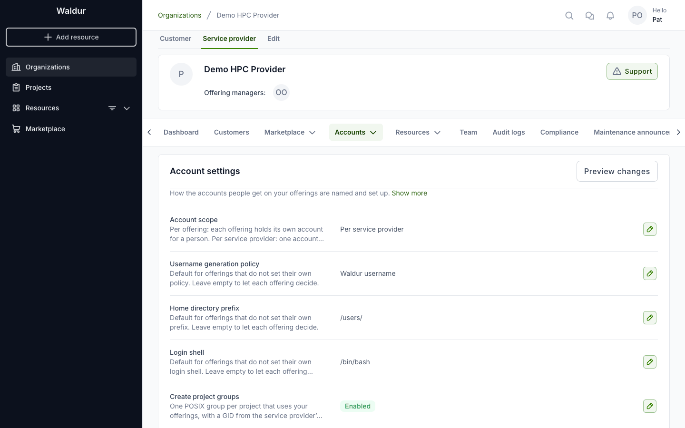
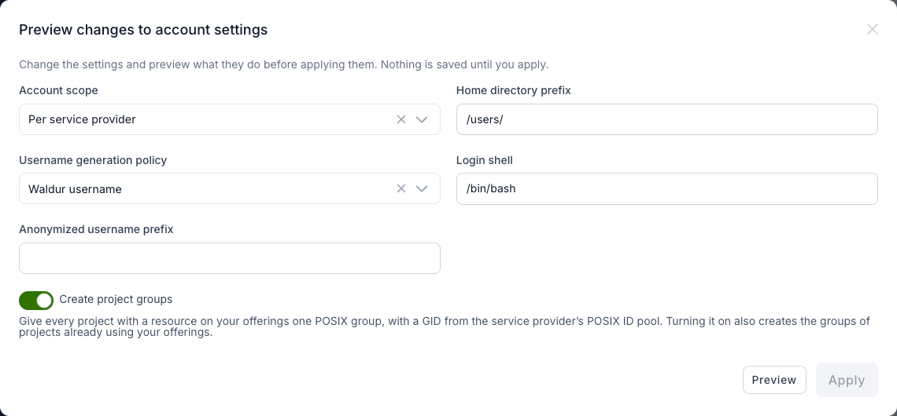
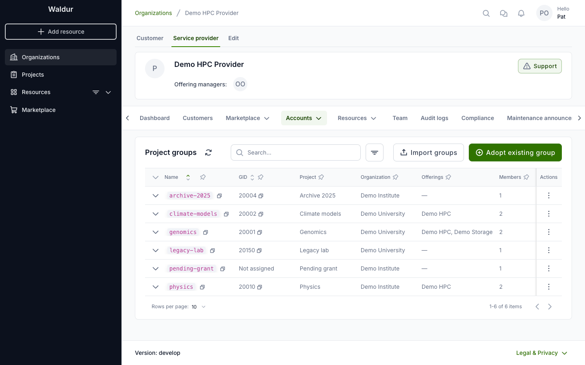
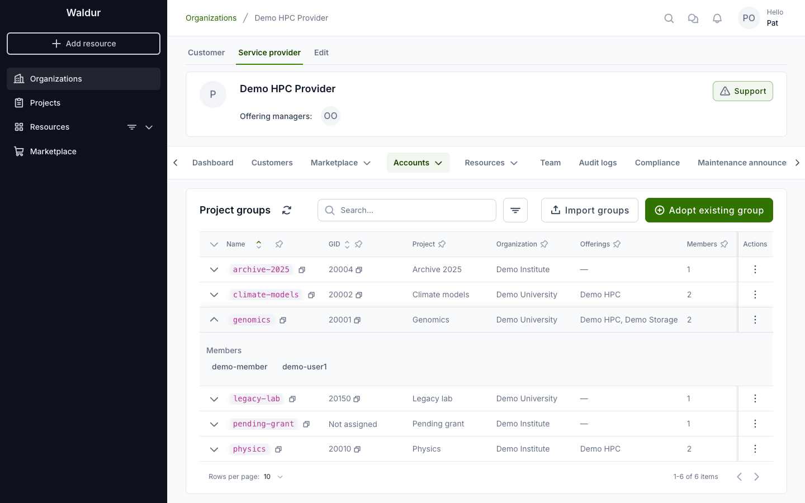
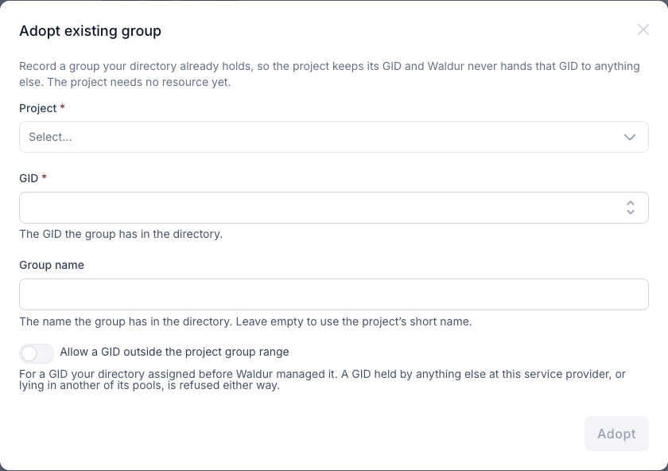
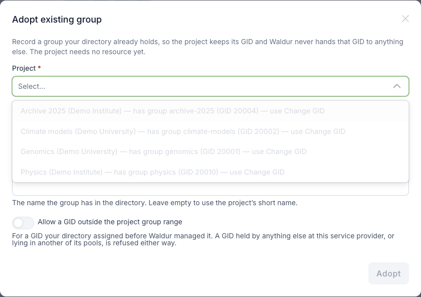
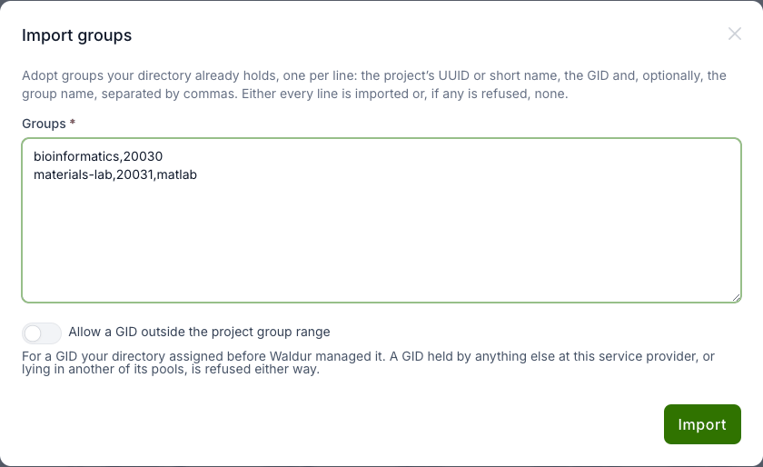
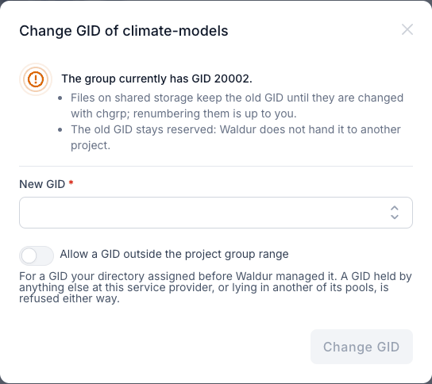

# Project groups

A **project group** is the one POSIX group a project gets at your service
provider. It has a name and a GID that stay the same for the life of the
project, and its members are the accounts that the project's members hold on
your offerings. Clusters grant access through it, and files on shared storage
are owned by it.

Waldur keeps the groups; a directory writer such as the
[site agent's LDAP plugin](openldap-sssd-accounts.md#project-groups-in-the-directory)
or [GLAuth](glauth-user-accounts.md) puts them into the directory your hosts
read.

!!! note
    Project groups appear under **Accounts → Project groups** in your provider
    workspace, next to **POSIX ID pools**. Both are shown only when the platform
    operator has enabled the `marketplace.show_posix_id_pools` feature flag.

## How a project group works

- **One group per project and service provider.** Every offering of the
  provider that the project uses shares the same group. A project that uses two
  providers has one group at each, with GIDs that each provider numbers on its
  own.
- **The name is the project's short name.** The group is named after the
  project's short name (slug) when it is created: lowercased, with characters
  other than letters, digits, `-` and `_` replaced by `-`, at most 32
  characters. If the name is taken, `-2`, `-3`, … is added. A short name that is
  empty or does not start with a letter gives `p` followed by the first eight
  characters of the project's UUID. Names are unique per provider, ignoring
  case.
- **The name never changes.** Renaming the project or changing its short name
  later does not rename the group, so directory entries and scripts that refer
  to it keep working.
- **The GID is never reused.** The GID comes from the provider's
  [POSIX ID pool](posix-id-pools.md#project-group-gids) and is never handed to
  another project, not even after the group's GID was changed or its project
  deleted. Files may still carry it.

### When a group is created

A project gets its group when its **first resource at your service provider is
approved**: the first resource on any of your offerings whose create order has
left the approval steps. A resource that is still waiting for approval by the
consumer, by you, by the project or for its start date does not create a group,
and a rejected or cancelled order never takes a GID. Moving a resource into a
project, or an offering to your provider, creates the groups that are then
needed.

Only offerings that create accounts for their users count: Basic, Script and
site agent offerings, unless the offering turns POSIX accounts off.

The site agent writes a new group to the directory within seconds when it
runs with event processing (STOMP) enabled, and otherwise on its next periodic
reconcile. See
[Project groups in the directory](openldap-sssd-accounts.md#project-groups-in-the-directory).

Further resources, on the same or another of your offerings, reuse the group.
When the project's last resource at your provider is terminated, or the
project is deleted, the group stays, marked **Not in use**, and keeps its GID.
A new resource later picks up the same group and GID.

## Rolling out project groups

Your directory may already hold groups for some projects, with GIDs that files
on your storage carry. To keep those GIDs, enable project groups in this order:

1. **Set the project group GID range** on the service provider's POSIX ID pool
   (see [project group GIDs](posix-id-pools.md#project-group-gids)).
2. **Adopt the groups your directory already holds** under **Accounts → Project
   groups**, one by one with [Adopt existing group](#adopting-an-existing-group)
   or many at once with [Import groups](#importing-many-groups).
3. **Enable "Create project groups"** on **Accounts → Account settings**. Every
   project with a resource on your offerings then gets a group, with the next
   free GID from the range.



The setting is changed in the account settings preview: click the edit button
on the **Create project groups** row, turn the switch on, then **Preview** and
**Apply**. The preview warns when the provider's pool has no project group
range, because the groups would then share the GID range with users' primary
groups.



!!! tip
    Turning the setting on also creates the groups of projects that already use
    your offerings. Groups that could not get a GID yet, because no range had
    one free, get it as soon as a range can supply one: when the pool is
    created, when a range is added or widened, or when the setting is turned on.

Turning the setting off stops new groups from being created. Existing groups
stay listed and keep their GIDs.

## The Project groups page

Open your provider workspace and go to **Accounts → Project groups**.



| Column | Meaning |
|--------|---------|
| **Name** | The group name in the directory |
| **GID** | The group's GID, or **Not assigned** while no range could supply one |
| **Project** | The project the group belongs to; **Deleted project** once the project has been removed |
| **Organization** | The project's organization |
| **Offerings** | Your offerings on which the project currently has a resource |
| **Members** | The number of members; expand the row to see their usernames |
| **Status** | **In use** while the project has a resource on one of your offerings, **Not in use** otherwise |
| **Created** | When the group was created |

Search matches the group name, the project name or short name, the
organization name, and the exact GID. The filter offers **Usage** (in use or not
in use) and **Offering** (groups of projects that use that offering).

Expand a row to see the group's members: the usernames of the accounts that
the project's members hold at your provider.



A user is a member while their account is active, they hold a project role
that has not expired, and their account at your provider is live (requested,
being created, pending, active, or failed on creation) and has a username. A
username is left out when every account carrying it at your provider is
restricted. Robot and service accounts are not members.

## Adopting an existing group

Adopt a group your directory already holds so that the project keeps its GID
and Waldur never hands that GID to anything else. The project does not need a
resource yet.

1. Click **Adopt existing group**.
2. Select the **Project**. The list shows projects that have a resource or an
   order on your offerings; a project that already has a group shows it and
   cannot be selected — use [Change GID](#changing-a-gid) for it instead.
3. Enter the **GID** the group has in the directory.
4. Optionally enter the **Group name** it has in the directory. Leave it empty
   to use the project's short name.
5. Click **Adopt**.





The GID must lie inside the project group range of the provider's pool. Turn on
**Allow a GID outside the project group range** for a GID that your directory
assigned before Waldur managed it. Either way, Waldur refuses a GID that is
already held at your provider — by an account, another group, or another
consumer of the pools — or that lies inside the GID range of another of your
pools. A name must start with a letter or `_`, contain only lowercase letters,
digits, `-` and `_`, be at most 32 characters long, and not be used by another
group of your provider in any case.

!!! note "Who may adopt"
    Organization owners of the service provider and staff. An owner may adopt
    only for projects that have a resource or an order, in any state, on one of
    the provider's offerings. Staff may adopt for any project, which covers
    recording a group before the project's first order.

## Importing many groups

To adopt many groups at once, click **Import groups** and enter one group per
line: the project's UUID or short name, the GID and, optionally, the group
name, separated by commas.

```text
bioinformatics,20030
materials-lab,20031,matlab
0b4a1c2d3e4f5a6b7c8d9e0f1a2b3c4d,20032
```



A short name works when exactly one eligible project has it. The import is
**all or nothing**: if any line is refused, nothing is imported and the dialog
lists the lines that were refused and why. The same rules as for a single adopt
apply to every line, including who may import and
**Allow a GID outside the project group range**.

## Changing a GID

Use **Change GID** in a row's actions menu to give a group another GID, for
example when its GID clashes with one that something outside Waldur already
uses. For a group without a GID the action is called **Set GID**.



!!! warning
    Changing a GID does not touch your files. Files on shared storage keep the
    old GID until they are changed with `chgrp`; renumbering them is up to you.
    The old GID stays reserved: Waldur does not hand it to another project.

The new GID follows the same rules as an adopted one. Every change is recorded
in the audit log with the old and the new GID. Only organization owners of the
service provider and staff can change a GID.

## Who sees what

| Who | What they can do |
|-----|------------------|
| Staff | See and manage all project groups |
| Support users | See all project groups |
| Organization owners of the service provider | See the provider's groups, adopt, import, change GIDs, and enable project groups |
| Service managers of the service provider | See the provider's groups |
| Offering managers of any of the provider's offerings | See the provider's groups — this is how the site agent reads them |
| Project members and organization owners of the project | See the project's groups at every provider on the project page (see [your POSIX identity](../end-users/posix-identity.md#your-projects-posix-groups)) |

## When an account is renamed

A username can change after a group already lists it, for example when the
username generation policy changes or a user's identity provider name changes.
Project group members always carry the current username.

A directory writer has to recognise that the new name belongs to an existing
entry. The site agent's LDAP plugin does this with a key it keeps in the
directory: with `waldur_username_attribute` set (`employeeNumber` is the
recommended attribute), it stores each person's Waldur username on their entry.
When Waldur reports a new Linux username, the agent renames the entry carrying
that key in place, provided its UID still matches, and replaces the old username
in the groups. Without the setting the agent never renames an entry. See
[renames in the directory](openldap-sssd-accounts.md#renames) for the details.

With the plugin's `membership: add_only` setting the old username stays in the
group next to the new one, because that mode never removes members.
