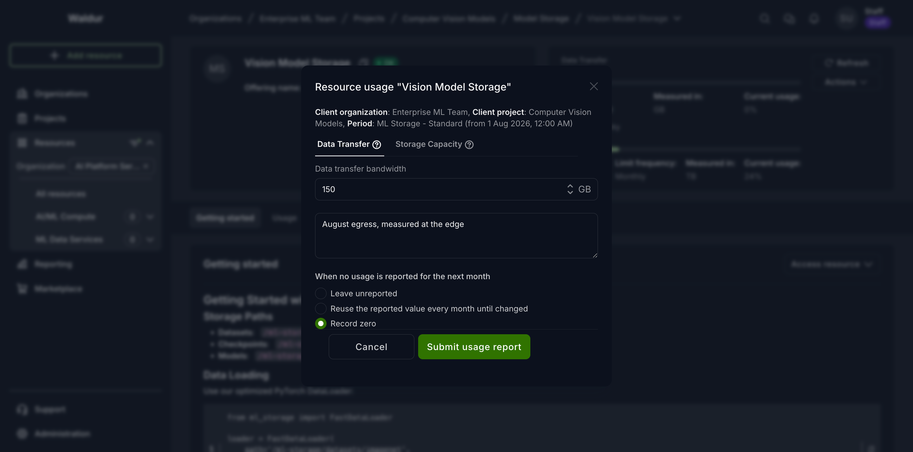

# Reporting resource usage

Offerings billed by usage need a usage report for each billing period. Reports normally arrive
automatically from a site agent, but a service provider can also submit them by hand from Waldur.

## Submitting a report

1. Open your organization, switch to the **Service provider** tab and select **Resources**.
2. Find the resource and open the actions menu (⋮), or open the resource and use the **Actions**
   menu. Under **Provider actions**, choose **Report usage**.
3. The dialog opens with one tab per reportable component. Fill in the **Amount** on each tab — the
   report cannot be submitted while any component is missing an amount.
4. Optionally add a description. It is stored with the report and shown in the usage history.
5. Choose what should happen if the next month passes with no report (see below).
6. Select **Submit usage report**.

## When no usage is reported for the next month

Each component carries its own setting for what Waldur should record if the following billing period
goes by without a report. The choice is made per component, so one component of a resource can carry
its value forward while another is left blank.

| Option | What is recorded next month |
|--------|-----------------------------|
| **Leave unreported** (default) | Nothing. The period stays blank, and nothing is billed for it. |
| **Reuse the reported value every month until changed** | The value from this report is repeated. |
| **Record zero** | An explicit zero. |

The distinction between the first and third options matters when a resource legitimately goes idle —
an allocation that ran no jobs, a service that handled no requests. *Leave unreported* records
nothing, which reads as "we do not know". *Record zero* states that the usage was measured and it
was nothing, so reports and statistics show a complete picture.

!!! note
    Whichever option is chosen, an actual report always wins. If you submit a report for the new
    month, that value is kept — a reused value or a zero is only ever filled into a gap.

!!! warning
    **Record zero** produces an invoice line with a quantity of zero, exactly as reporting `0`
    by hand does. On an offering with many components this makes invoices longer, though the
    amount charged is unaffected.

Re-reporting also resets this setting. A new report always states its own choice, so a component
left on **Leave unreported** in the latest report stops carrying values forward.

## Reporting for individual users

Where an offering tracks per-user consumption, **Report user usage** records a breakdown against
usernames. Per-user records only split up the total, so they do not carry a missing-usage setting of
their own — that belongs to the resource's total usage report.

## Viewing what was reported

Open the resource and select the **Usage** tab to see the history per component, as a chart or as a
table. Consumers see the same history for their own resources; see
[Usage reports](../customer-organization/usage_reports.md).
