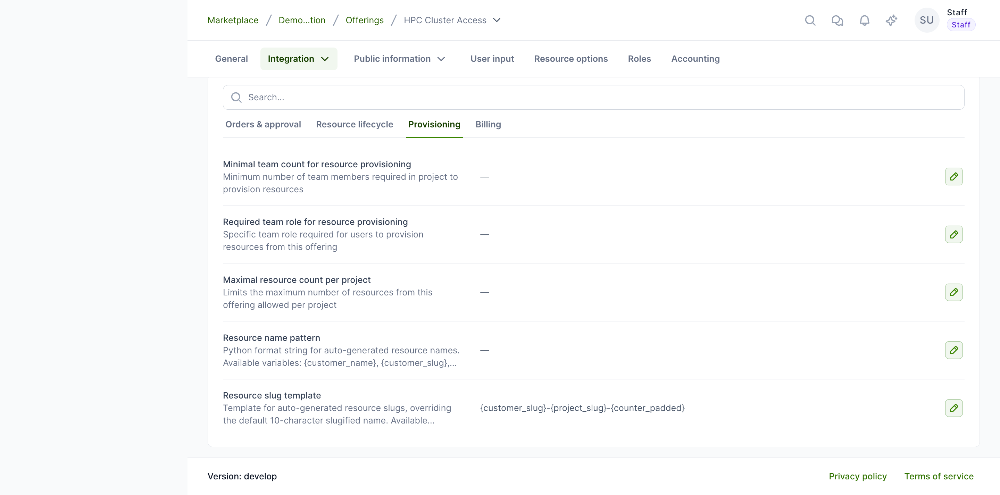

# Resource slug template

Waldur lets service providers configure how resource **slugs** are generated, per offering. This is useful when a backend derives identifiers from the slug and the default, shortened slug is too restrictive.

## How resource slugs work

Every resource receives a unique **slug** (identifier) when it is created. By default the slug is the slugified resource name, **truncated to 10 characters** (for example, a resource named `Machine Learning Cluster` becomes `machine-le`).

Some backends build their own object names from this slug. For example, the SLURM site agent forms the SLURM account name as `<prefix><resource-slug>`, so the 10-character default limits how descriptive those account names can be.

Two per-offering options let you lift this limit:

- **Resource slug maximum length** — keep the default, name-based slug but allow more characters (the simplest option).
- **Resource slug template** — build a fully custom, structured slug from organization, project, and offering identifiers.

Both are set under **Edit** → **Integration** → **Operations** → **Provisioning**.

## Increasing the slug length

**Performed by:** Service provider (offering owner)

Set **Resource slug maximum length** to the number of characters you want (up to 40). The slug is still derived from the resource name, just truncated at the configured length instead of 10.

For example, with a maximum length of `30`, a resource named `Machine Learning Cluster` becomes `machine-learning-cluster` instead of `machine-le`.

!!! note
    Leave this empty to keep the 10-character default. It is ignored when a **Resource slug template** is set.

## Configuring the template

**Performed by:** Service provider (offering owner)

1. Open the offering and select **Edit** → **Integration**.
2. Open the **Operations** card and switch to the **Provisioning** tab.
3. Set the **Resource slug template** using the variables below.

When the template is left empty, Waldur keeps the default behaviour (slugified name, 10 characters).

## Available template variables

| Variable | Description | Example value |
|---|---|---|
| `{customer_slug}` | Organization slug | `demo-organ` |
| `{project_slug}` | Project slug | `demo-proje` |
| `{project_name}` | Slugified project name | `demo-project` |
| `{offering_slug}` | Offering slug | `basic-vm` |
| `{year}` | Current year | `2026` |
| `{month}` | Current month (2-digit) | `06` |
| `{counter}` | Sequential counter for the project and offering | `7` |
| `{counter_padded}` | Zero-padded counter (3 digits) | `007` |

## Example patterns

| Pattern | Example output |
|---|---|
| `{customer_slug}-{project_slug}-{counter_padded}` | `demo-organ-demo-proje-001` |
| `{offering_slug}-{year}{month}` | `basic-vm-202606` |
| `{project_slug}-{counter}` | `demo-proje-7` |

!!! note
    The default pattern (if no template is configured) is the slugified resource name, limited to 10 characters.

## Important considerations

- The template applies only to **newly created** resources. Existing resource slugs are never regenerated.
- The rendered value is slugified (lowercase, hyphen-separated) so it stays safe for backends such as SLURM.
- Keep the rendered slug within **40 characters** — Waldur rejects templates whose output would be longer, leaving room for a uniqueness suffix.
- If two resources would produce the same slug, Waldur appends a numeric suffix (`-2`, `-3`, …) to keep slugs unique.
- If the template contains an unknown variable or cannot be rendered, Waldur logs a warning and falls back to the default slug.
