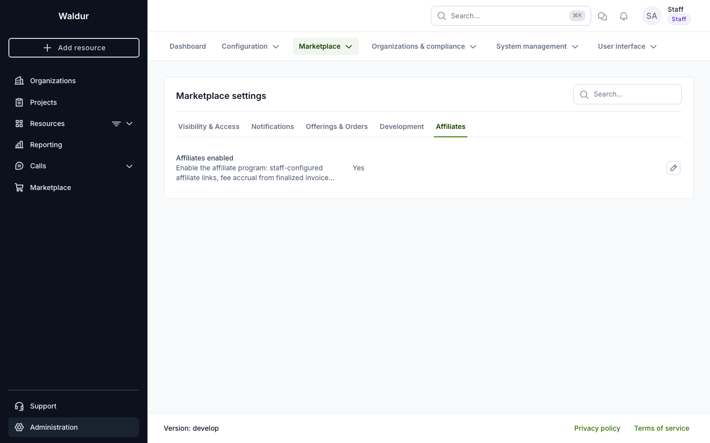
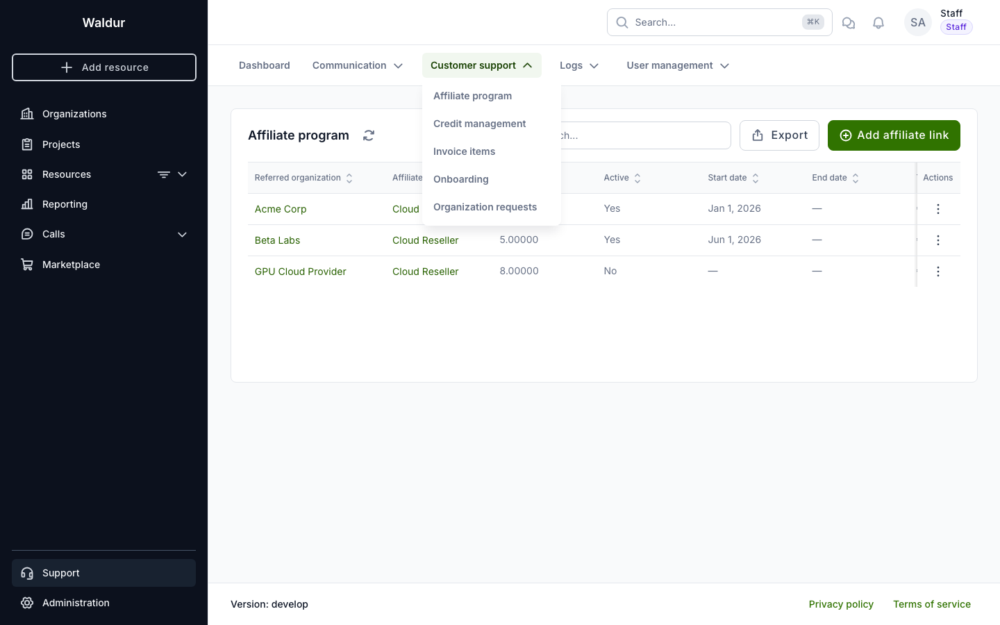
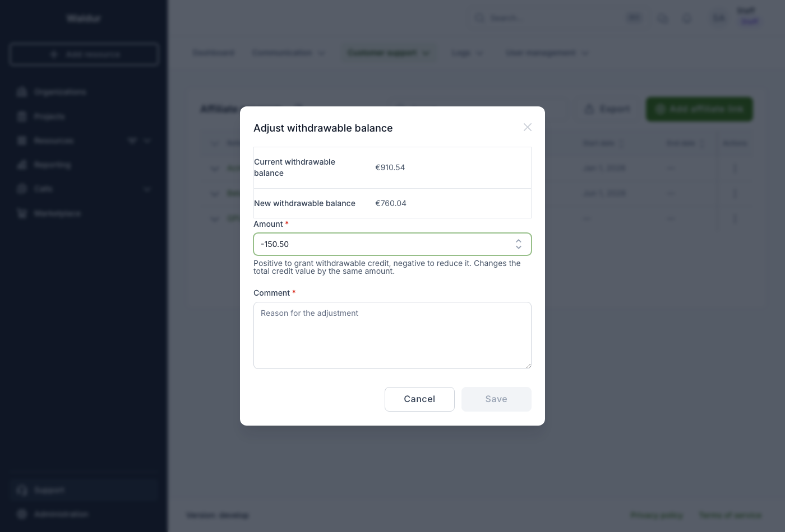
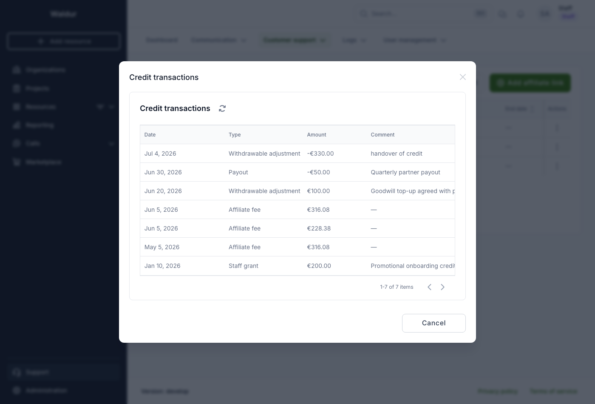

# Affiliate program (staff)

The affiliate program lets one organization (the **affiliate**) earn a fee from
the finalized invoices of another organization (the **referred** organization).
Affiliate links are configured by staff.

!!! note
    The affiliate program is opt-in and gated by two switches. Enable the
    **`AFFILIATES_ENABLED`** setting under **Administration → Marketplace →
    Settings → Affiliates** to expose the affiliate API and start accruing fees,
    and switch on the **`reseller.affiliates`** feature (Administration →
    Feature toggles) to show the affiliate menus and pages. Both must be on;
    while either is off, existing links stay dormant.

!!! tip
    Volume discounts are a separate feature configured by the **service
    provider** on the offering's plan components — see
    [configuring volume discounts](../service-provider-organization/adding-an-offering.md#volume-discounts).

## Managing affiliate links

Open **Support → Customer support → Affiliate program** to see all affiliate
links.

Each link records:

- **Referred organization** — the organization whose invoices generate the fee.
- **Affiliate organization** — the organization that earns the fee.
- **Fee %** — the percentage of each finalized invoice's net price (pre-tax,
  post-compensation) paid to the affiliate.
- **Active**, **Start date**, **End date** — control when the link accrues fees.
- **Total earned** — the lifetime fee accrued through the link.

Click **Add affiliate link** to create a link. Pick the referred and affiliate
organizations, set the fee percentage and the active window, and save.

### How fees accrue

When an invoice is finalized at the end of the month, an affiliate fee is
computed on its net price and added to the affiliate organization's credit
balance. Accrual is idempotent — re-running finalization never pays a fee
twice. Fees for a referred organization are only visible to the affiliate as an
amount and period; the affiliate never sees the referred organization's invoice
contents.

## Adjusting the withdrawable balance

The **withdrawable balance** is the part of an organization's credit that came
from earnings (such as affiliate fees) rather than promotional grants. Staff can
adjust it manually — for example to record a negotiated top-up, a payout or a
clawback.

Open the affiliate organization's **Accounting → Affiliate earnings** page and
click **Adjust withdrawable balance** (staff only).

Enter a signed **amount** (positive to grant, negative to reduce) and a
**comment** describing the reason. The dialog shows the current withdrawable
balance and the resulting new balance as you type. The adjustment is recorded as
a `Withdrawable adjustment` entry in the credit-transaction ledger and changes
the total credit value by the same amount.

!!! note
    A reduction cannot exceed the current withdrawable balance — a payout can
    only draw down earned credit, never staff-granted promotional credit.

Click **Credit transactions** on the same page to see the full ledger — every
change to the credit value with its type, amount, comment and date. It is
visible to staff and to the organization's owners.

