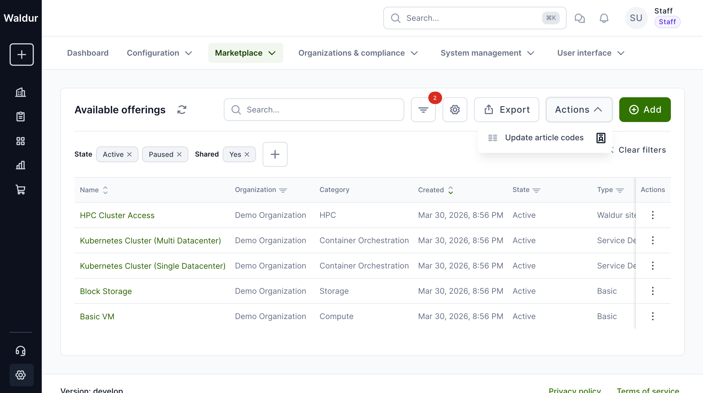
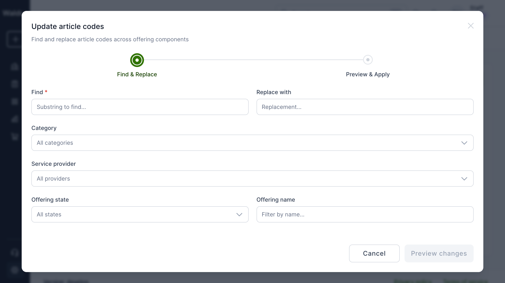
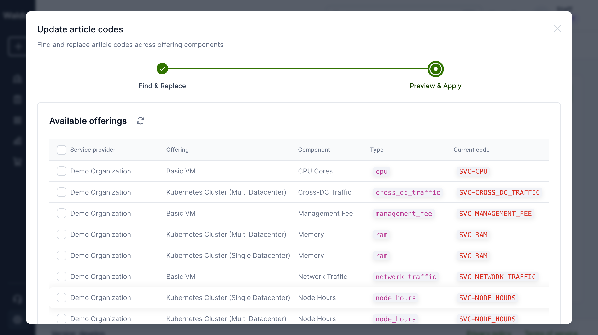

# Bulk article code update

The article code update tool allows staff users to find and replace article codes across offering components in bulk. This is useful when provider prefixes change, organizational restructuring occurs, or accounting systems require systematic code updates.

## Accessing the tool

1. Log in as a **staff user**.
2. Navigate to **Administration** > **Marketplace** > **Available offerings**.
3. Click the **Actions** dropdown in the toolbar and select **Update article codes**.

## Step 1: Find and replace

A wizard dialog opens with two steps. In the first step:

1. Enter the **substring to find** in the "Find" field (e.g., `SVC`).
2. Enter the **replacement string** in the "Replace with" field (e.g., `PRD`).
3. Optionally narrow down affected components using filters:
    - **Category** - filter by offering category (e.g., HPC, VMs).
    - **Service provider** - filter by the organization that owns the offerings.
    - **Offering state** - filter by Active, Draft, Paused, etc.
    - **Offering name** - free-text search on offering name.
4. Click **Preview changes** to see the results.

## Step 2: Preview and apply

The second step shows a table of all matching components with their current and new article codes.

1. Review the table. Each row shows the service provider, offering, component, current code, and the new code after replacement.
2. Use **checkboxes** to select or deselect individual components. Only selected components will be updated.
3. Click **Apply changes (N)** in the action bar to execute the replacement.

!!! warning
    Article code changes take effect immediately and cannot be undone automatically. Double-check the preview before applying.

!!! note
    Article codes are used in billing and invoicing. Changing them affects how future invoice items are categorized. Existing invoice items retain their original article codes.
