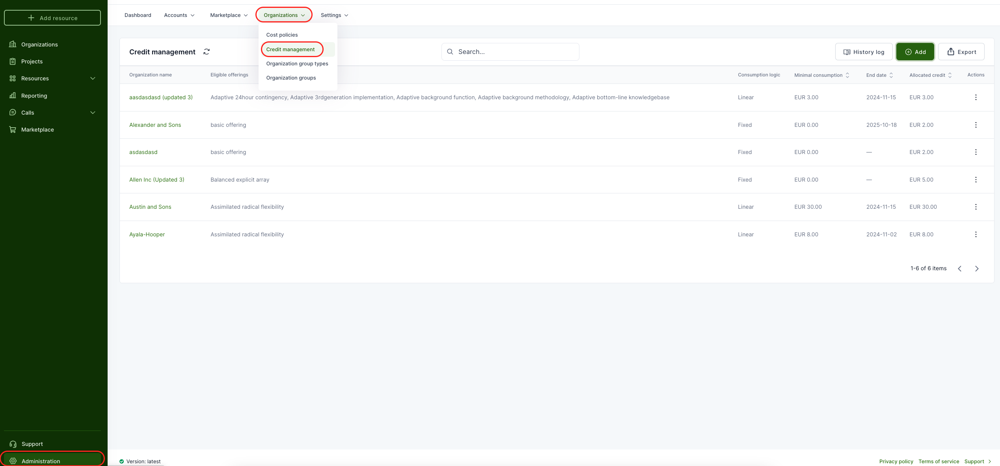
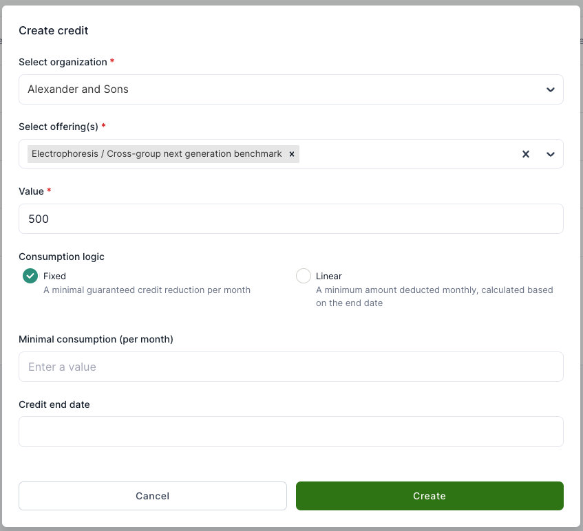

# Credit management configuration for staff

Credit management establishes credit limits for organizations that can be used for purchasing eligible services.
The credit can optional be sub-allocated to projects and used in [cost policies](../customer-organization/cost-and-usage-policies.md).

Users with staff role can allocate credit points to organizations. This can be done by selecting Administration from the left side menu and then Organizations -> Credit management from the top menu.

This page provides an overview of already assigned credit policies. To create a new one, click on "Add" from the right. A popup opens with different configuration fields.

1. Select an organization to which you would like to assign credits.
2. Select the offerings the credit may be spent on. **Leave this empty to allow all offerings** —
   an empty list means unrestricted, not "none". Cost on any other offering is invoiced
   normally and is never drawn from the credit.
3. Set the credit value. This is the total value that the organization will be able to spent.
4. Minimal consumption logic defines, how minimal monthly consumption is calculated:

    - Fixed means that it is possible to define minimal monthly value and overall credit will be reduced by the monthly value, even if the usage has been less than minimal consumption.
    - Linear means that by setting the end date, the total value of the credit will be divided evenly across the period until the end date and the overall value will be reduced monthly by the calculated value even if the consumption is less than the calculated value.

5. If all set, click "Create".

!!! warning
    Restricting the offerings is not the same as excluding cost from the organization.
    Resources on offerings outside the list are still bought and still invoiced — the
    credit simply never covers them. Because that cost is never compensated, it counts
    towards [cost policies](../customer-organization/cost-and-usage-policies.md)
    immediately, while the credit balance still looks untouched.
