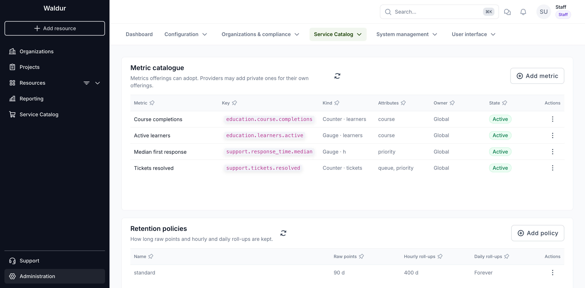
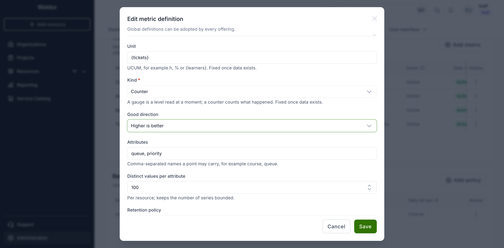
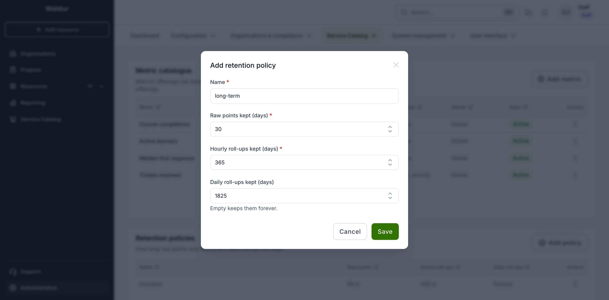
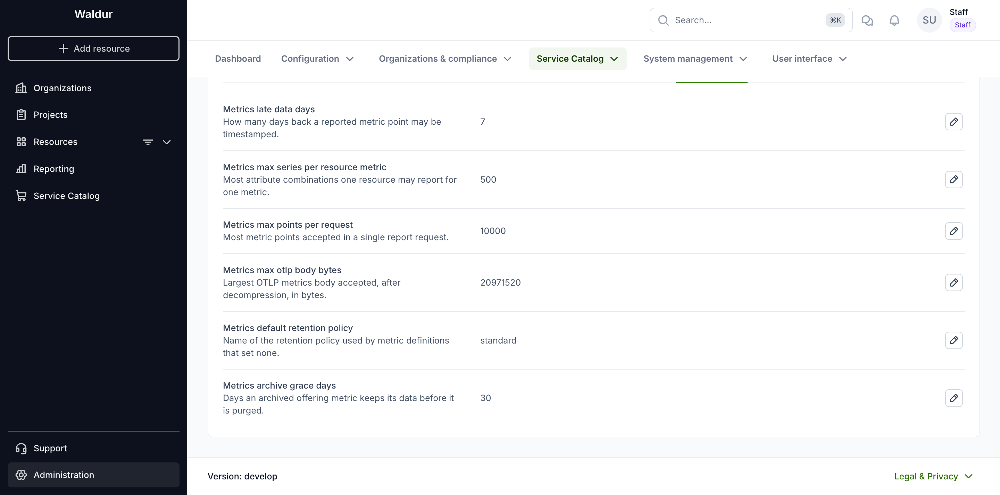

# Custom metrics catalogue

Services can report their own metrics to Waldur — course completions, active
learners, tickets resolved, response times — and projects see them next to
their resources. Every metric a service reports must first exist in the
**metric catalogue**, so a typo in a service never creates a new metric and the
amount of stored data stays bounded.

Staff curate the global catalogue that every offering can adopt. A service
provider can add private definitions for its own offerings through the API.

!!! note
    The feature is behind the **Show custom metrics** feature flag
    (`project.show_custom_metrics`). Turn it on under
    **Administration → User interface → Features** before the metrics tabs
    appear.

## The catalogue

Open **Administration → Service Catalog → Custom metrics**.

Each definition has:

- **Key** — the name services report against, written as lowercase dotted
  words, for example `education.course.completions`. It never changes once
  created.
- **Kind** — what a reported number is, and the unit it is measured in:
    - a **Gauge** is a level read at a moment, such as active learners or a
      median response time;
    - a **Counter** counts things that happened, such as courses completed.
- **Attributes** — the names a point may carry to break a figure down, for
  example `course` or `queue`. A point with any other attribute is refused.
- **Owner** — **Global**, or the service provider a private definition belongs
  to.
- **State** — **Active**, or **Deprecated** when offerings may no longer adopt
  it.

## Adding or editing a definition

Choose **Add metric**, or **Edit** in a row's actions menu.

- **Unit** uses [UCUM](https://ucum.org/) notation: `h`, `%`, or an
  annotation in braces for counted things, such as `{learners}`. Waldur shows
  annotations without the braces.
- **Good direction** tells the dashboard whether a rising figure is good news
  (completions) or bad news (response time), and colours the change badge
  accordingly.
- **Distinct values per attribute** caps how many different values one
  attribute may take for one resource. Together with the series cap below it
  keeps a misbehaving service from flooding the database.
- **Retention policy** decides how long the metric's data is kept; empty uses
  the default policy.

!!! warning
    Once any data has been reported, a definition's **kind** and **unit** can
    no longer change and attributes can only be added, because the stored
    history was reported under those rules. Deprecate a definition instead of
    deleting it: a definition that offerings have adopted cannot be removed.

## Retention policies

Waldur keeps three tiers of data for every metric:

| Tier | Detail | Used for |
|------|--------|----------|
| Raw points | Every point a service sent | Short ranges, up to two days |
| Hourly roll-ups | Count, sum, minimum, maximum and latest value per hour | Ranges up to two months, period figures |
| Daily roll-ups | The same per day | Long-range trends |

A **retention policy** says how many days each tier is kept. The `standard`
policy, created on installation, keeps raw points for 90 days, hourly roll-ups
for 400 days and daily roll-ups forever. Add a policy with **Add policy**:

Each tier must be kept at least as long as the finer one before it, and raw
points longer than the late-data window. Policy names are unique. The default
policy (named by `METRICS_DEFAULT_RETENTION_POLICY`) cannot be removed or
renamed.

Roll-ups are recomputed every 15 minutes, so a figure on the dashboard can lag
a fresh report by up to a quarter of an hour. Expired data is deleted once a
day.

## Limits

These settings live under **Administration → Service Catalog → Settings**, on
the **Custom metrics** tab:

| Setting | Default | Meaning |
|---------|---------|---------|
| `METRICS_LATE_DATA_DAYS` | 7 | How far back a point's timestamp may be. Older points are refused. |
| `METRICS_MAX_SERIES_PER_RESOURCE_METRIC` | 500 | Most attribute combinations one resource may report for one metric. |
| `METRICS_MAX_POINTS_PER_REQUEST` | 10000 | Most points accepted in one request. |
| `METRICS_MAX_OTLP_BODY_BYTES` | 20 MB | Largest OpenTelemetry body accepted, after decompression. |
| `METRICS_DEFAULT_RETENTION_POLICY` | `standard` | Policy used by definitions that set none. |
| `METRICS_ARCHIVE_GRACE_DAYS` | 30 | How long an archived offering metric keeps its data before it is purged. |

## Related pages

- [Custom metrics for service providers](../service-provider-organization/custom-metrics.md)
- [Project metrics](../customer-organization/project-metrics.md)
