# Offering merges

A merge moves everything that belongs to one or more **source** offerings onto a single
**target** offering and archives the sources. Resources, their orders, usage and quota
history, billing periods and invoice items keep existing — they simply point at the target
afterwards. No offering and no resource is deleted, and no amount on any invoice changes.

Merging is the tool for consolidating a catalogue that grew one offering per tier or per
contract into one offering with several plans, and for moving resources between the
offering types that do not provision anything on a backend.

Only users with the staff role can create, edit, run or undo a merge. Support users can
open the same pages and read every merge, but see no buttons that change anything. Through
the API a support user may also compute a preview; it is returned to them but never stored
on the record.

!!! warning
    A merge rewrites billing references and archives offerings. Run it outside the busiest
    hours, after the sources have no pending orders, and check the verification report
    before telling anyone the work is done. Undo exists, but it is refused once the moved
    data has changed (see [Undoing a merge](#undoing-a-merge)).

## When to merge

- **Consolidating tiers into plans.** Two or more offerings that describe the same service
  at different price points become one offering whose plans are those tiers.
- **Moving between Basic, Service Desk and Site Agent offerings.** These three types have
  no backend object behind a resource, so their resources can move in any direction: a
  Basic offering into a Service Desk one, a Service Desk one into a Site Agent one, and so
  on.
- **Cleaning up duplicate per-tenant offerings.** When a provider ended up with several
  auto-created offerings for one and the same tenant, merging them leaves one.

## When not to merge

- **Types whose resources have a backend object.** OpenStack, VMware, Rancher, Script and
  Booking resources point at something outside the marketplace — a tenant, a virtual
  machine, a cluster, a calendar. The merge moves marketplace rows only; it never touches
  the backend. Merging two such offerings that describe *different* backends leaves
  resources whose new offering cannot serve them. The only safe case is duplicate
  offerings of one and the same backend scope, which the tool enforces: an offering with a
  parent may merge only with offerings that share that parent **and** that scope.
- **Different types.** A source may only be merged into an offering of its own type,
  unless both sides are among Basic, Service Desk and Site Agent.
- **Remote offerings.** An offering imported from another Waldur instance is refused on
  either side of a merge: the remote instance still owns its state.
- **An offering that has child offerings**, or an archived target.

## Preparing the target

The merge maps source plans and components onto **existing** target plans and components.
It never creates them, and it never copies prices. So before opening the wizard, open the
target offering and make sure that:

- **Every plan something still refers to has a counterpart.** In the worked example below,
  two source plans map onto one target plan — that is allowed, and is the usual way of
  consolidating tiers. [Map plans and components](#2-map-plans-and-components) lists
  exactly what counts as a reference.
- **Plan units match.** A plan billed per month cannot be merged into a plan billed per
  day. The mapping step lets you pick such a pair and flags it inline; the preview then
  blocks the merge with `plan_unit_mismatch`.
- **Every component in use has a counterpart with the same billing type.** A usage-based
  component cannot be mapped onto a limit-based or a fixed one. Component names may
  differ, types may differ — only the billing type has to match.
- **Prices on the target are the prices you want customers to pay from now on.** The merge
  does not change what past invoices charged, but from the moment it runs, the target
  plan's price list applies. The preview warns about every difference.
- **The target's order form covers the answers you care about.** Answers whose keys the
  target's form does not know are kept on the resources but no longer displayed.

The target keeps its own terms of service, consents, access policies, screenshots, files
and offering-level roles; nothing of that kind is copied from the sources. See
[What moves and what stays](#what-moves-and-what-stays).

## Opening the tool

Choose **Administration** from the left menu, then the marketplace section from the top
menu (it carries the deployment's own marketplace name — *Government Services* in the
screenshots below), and select **Offering merges**.

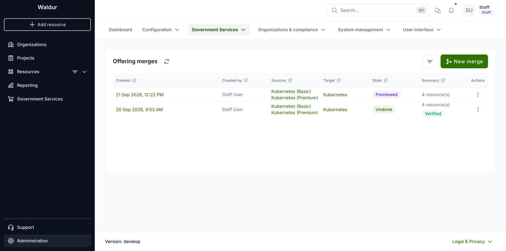

The page lists every merge with its sources, target, state and a summary of how many
resources it moved and whether verification passed. The row menu opens the merge, undoes a
finished one, or deletes a draft. **New merge** starts the wizard.

States a merge goes through:

| State | Meaning |
|-------|---------|
| Draft | Created; mappings may still be edited. |
| Previewed | A preview is stored and matches the current mappings. Only this state can run. |
| Queued, Running | Handed to a background worker. |
| Done | Executed; the verification report is stored. Can be undone. |
| Failed | Execution was rolled back; nothing was written. The record can no longer be edited or deleted, but running the preview again returns it to *Previewed* and unlocks the mappings. The wizard opens a failed merge on its last step. |
| Undoing, Undone | Undo in progress, or finished. |

### OpenStack duplicate offerings

Below the list, a second panel groups OpenStack offerings that belong to the same tenant
and are of the same type — the duplicates that auto-creation leaves behind. Each row shows
the organisation, the tenant, how many duplicates there are, how many blockers and
warnings a merge of them would raise, and how many orphaned resources the group has.
Expanding a row lists the candidate offerings with their resource counts and marks the one
recommended as the **Keeper**.

**Resolve in merge wizard** on the row opens the wizard with the group already filled in:
the keeper as the target, the other offerings as sources, and the group's suggested plan
and component mapping applied. Nothing is created until you choose **Create draft**, so it
is safe to open and look. The action is disabled when the group has no recommended keeper
or nothing left to merge.

The panel is shown only where the deployment has enabled it.

## The wizard step by step

### 1. Select offerings

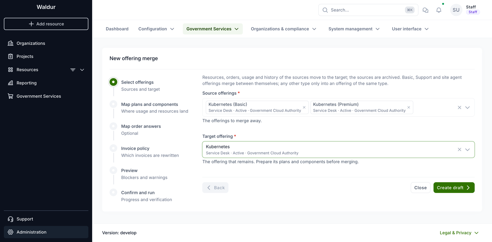

Pick one or more **source offerings** — the offerings to merge away — and the **target
offering** that remains. Each entry shows the offering's type, state and provider, which
is the quickest way to notice that two candidates are not of the same type or not of the
same provider.

Choosing **Create draft** stores the merge record. Nothing has been changed yet.

### 2. Map plans and components

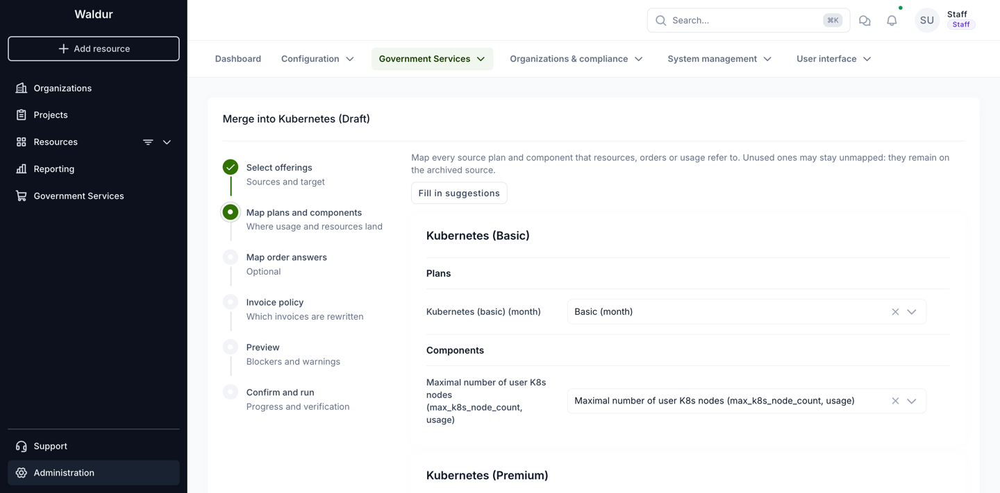

For each source, every plan and every component is listed with a target to choose.
**Fill in suggestions** proposes a mapping based on matching names and component types;
check it rather than trusting it.

- A plan or component that nothing refers to may stay unmapped. It remains on the archived
  source. Anything that *is* referred to must be mapped, or the preview blocks the merge.
- A **plan** is referred to when a resource, an order (its plan or the plan it is moving
  away from), a plan period, or a call's requested offering names it.
- A **component** is referred to when component usage, a quota, a poll record or a
  per-user usage limit names it; when a mapped source plan prices it — a plan component
  with a price or an amount; or when its type is used as a key inside a moved row's JSON,
  such as order answers or a resource's limits.
- Two components of one source may not be mapped onto the same target component: their
  usage, quotas and limits would collide.

### 3. Map order answers

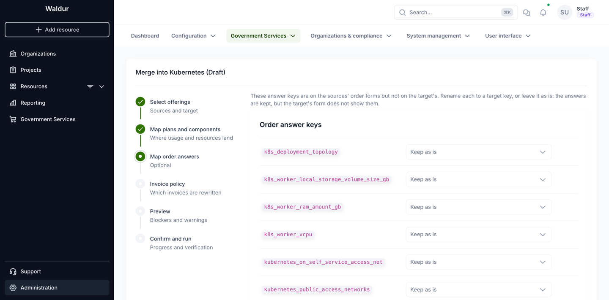

This step lists answer keys used by the sources' order forms that the target's form does
not have. Rename each one to a target key, or leave it as **Keep as is**: the answer stays
on the resource and the order, but the target's form does not show it. This step is
optional and is often left untouched.

### 4. Invoice policy

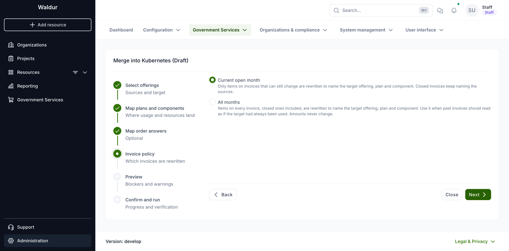

Invoice items carry a snapshot of the offering, plan and component they were billed for.
The policy decides how far back those snapshots are rewritten:

- **Current open month** (the default) rewrites only items on invoices that can still
  change. Snapshots on closed invoices keep naming the source offering and its plan.
- **All months** rewrites every item, closed invoices included, so the snapshots name the
  target throughout.

Neither option changes a price, a quantity or an invoice total.

Neither rewrites the invoice line's own **name** either. That text is composed when the
item is created and keeps naming the offering and the plan the line was billed under, in
every period, under both policies. Only the snapshot stored beside it, and the plan
component it points at, are rewritten — so after a merge a line can read
`k8s-basic-dev (Kubernetes (Basic) / Kubernetes (basic))` while its snapshot says
*Kubernetes* and *Basic*.

See [Invoice policy and accounting exports](#invoice-policy-and-accounting-exports) for
what this means for the SAF and SAP exports.

### 5. Preview

**Run preview** computes what the merge would do. It writes nothing except the stored
preview, and it is required before the merge can run. Changing any mapping afterwards
discards it, so preview again after every edit.

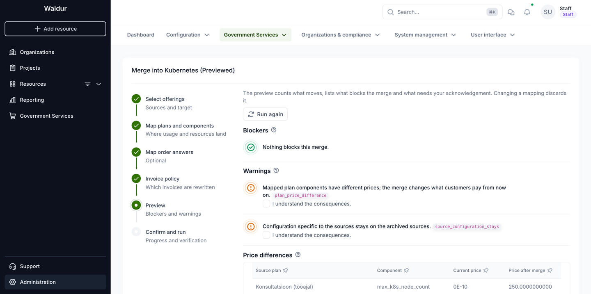

The preview has these panels, and one with nothing to show is left out:

- **Blockers** — conditions that stop the merge. Each carries a code; resolve them and run
  the preview again. See [Blockers](#blockers).
- **Warnings** — consequences you have to accept explicitly. Each one has an
  *I understand the consequences* checkbox, and the merge cannot run until all of them are
  ticked. See [Warnings](#warnings).
- **Price differences** — one row per mapped plan component whose price changes, with the
  price now and the price after the merge. It appears together with the
  `plan_price_difference` warning and is the detail behind it.
- **What the merge changes** — the rows it will write, grouped by the area of the service
  they belong to.
- **What stays on the sources** — the rows that describe the source offerings themselves
  and are left behind on them.
- **Invoices and usage summaries** — what the chosen invoice policy comes to in numbers.

Every heading on the preview, on the merge record and on the verification report carries a
question mark that explains, in a sentence, what the table below it lists.

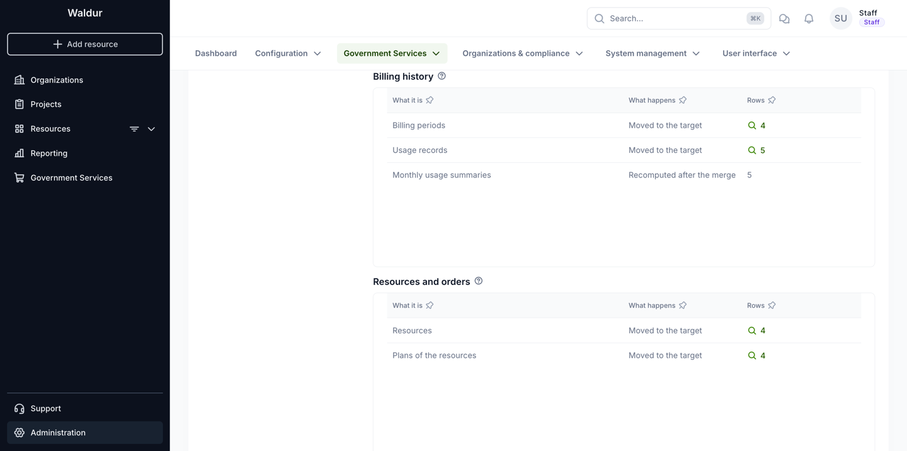

Each area — billing history, resources and orders, accounts and access, invoices, offering
configuration — has its own table, and an area with nothing in it is left out. Every row
names what it is, what happens to it, and how many rows of that kind there are. The
*What happens* column is the important one:

| What happens | Meaning |
|--------------|---------|
| Moved to the target | The rows follow the resources onto the target offering, plan or component. |
| Rewritten in place | The row stays where it is; the references inside it are rewritten — invoice item snapshots, resource limits, order answers. |
| Recomputed after the merge | Not moved but rebuilt from the moved data: the monthly usage summaries. |
| Moved unless the target has it already | Moved only where the target has no equivalent — offering users, credits, project templates. A second line says how many stay behind. |

A count is a link wherever the rows behind it can be listed. Opening it lists the objects
themselves, a page at a time, in three columns: **Object**, what it is in words —
an invoice line reads as its invoice, customer, resource, component, month and amount;
**What changes**, the value it has now, then a muted *becomes*, then the value the merge
gives it; and **Stays on the source**, for what the row leaves behind. It is the quickest
way to check that a rewrite does what you expect before running it.

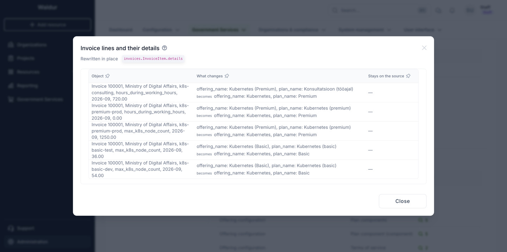

Rows that describe the sources rather than follow the resources — the source plans,
components, price lists and terms of service — are not counted as moving. They are listed
on their own under **What stays on the sources**, with the area they belong to.

The `source_configuration_stays` warning is narrower than that table. It deliberately
leaves out the plans, the offering components and the plan components, because those
staying behind is the whole point of a merge and never a surprise. The warning is about
the rest: terms of service, screenshots, files, access policies, announcements, endpoints
and the like.

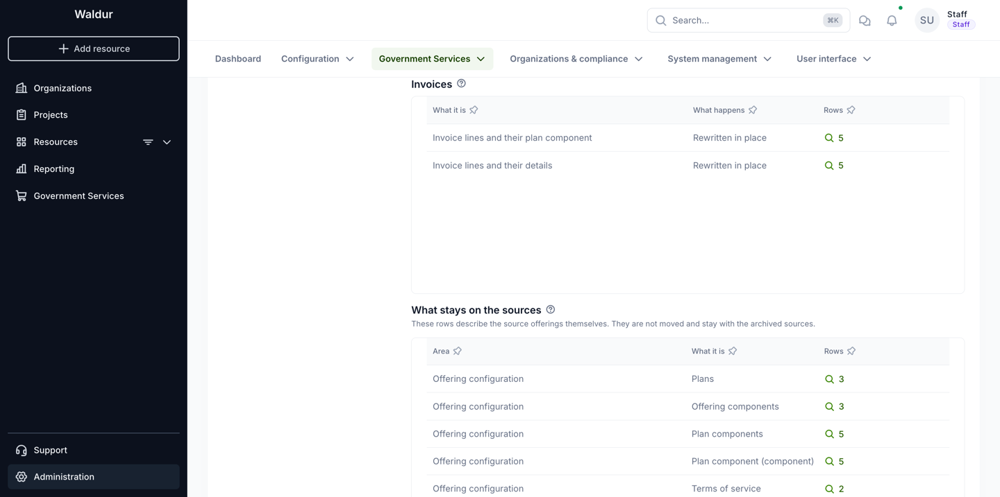

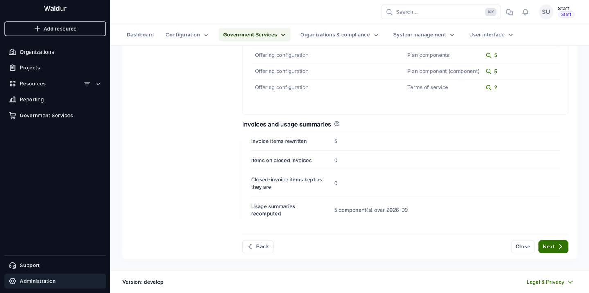

This panel shows how many invoice items the chosen policy rewrites, how many of them sit
on closed invoices, how many of those are left untouched, and which usage summaries are
recomputed afterwards.

When something blocks the merge, the preview names it:

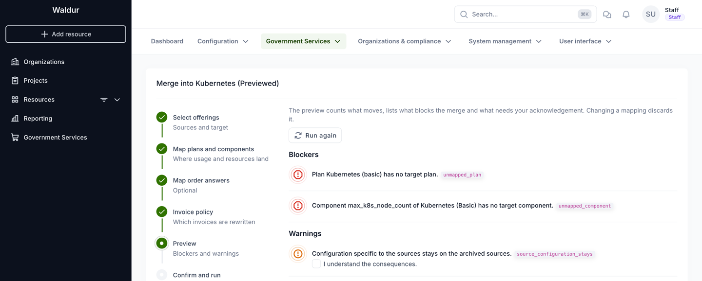

### 6. Confirm and run

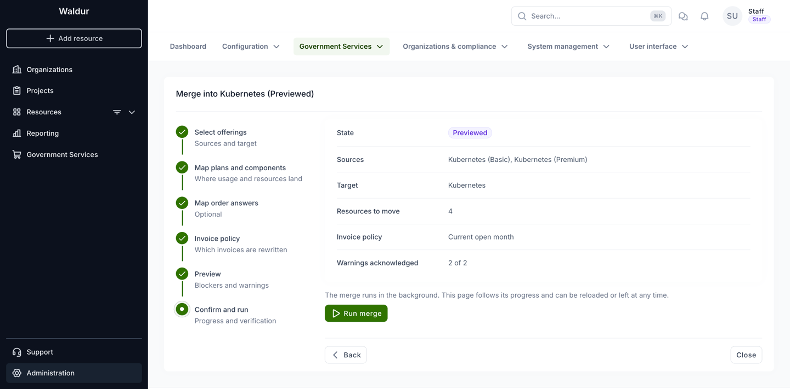

The last step repeats what is about to happen: sources, target, how many resources move,
the invoice policy, and how many warnings were acknowledged. **Run merge** hands the merge
to a background worker; the page follows its progress and can be reloaded or left at any
time.

The merge runs in a single transaction. If anything fails, every write is rolled back, the
merge moves to *Failed* and the reason is stored on the record.

Once the run has finished, the same step reports the outcome and links to the merge
record:

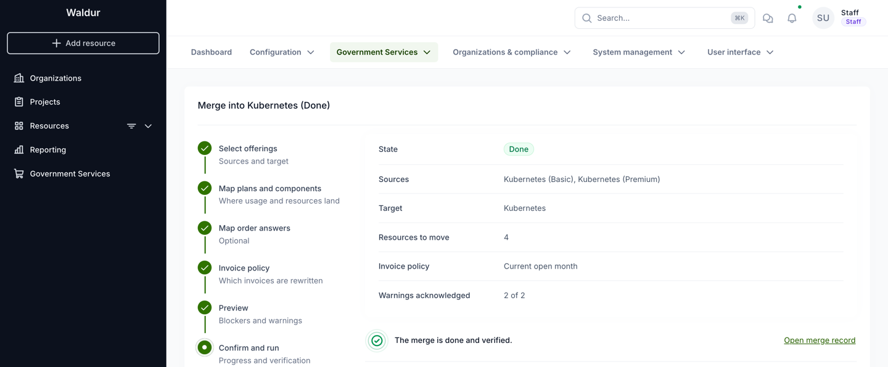

## Blockers

Every blocker carries a code. The preview and the refusal message both show it.

| Code | What it means | How to resolve it |
|------|---------------|-------------------|
| `no_sources` | No source offering was selected. | Select at least one source. |
| `target_in_sources` | The target is also listed as a source. | Remove it from the sources. |
| `target_archived` | The target offering is archived. | Activate or pause the target before merging into it. |
| `remote_offering` | One of the offerings was imported from another Waldur instance. | Remote offerings cannot be merged. Consolidate them on the instance that owns them. |
| `offering_hierarchy` | An offering has child offerings, or has a parent and the selection is not a set of siblings of one parent and one scope. | Merge only siblings of the same parent and scope; an offering with children cannot be merged at all. |
| `offering_type_not_allowed` | The source type differs from the target type, and they are not both among Basic, Service Desk and Site Agent. | Merge into an offering of the same type, or pick a target among the three interchangeable types. |
| `invalid_plan_mapping` | The plan mapping is malformed, or names a plan that is not a source plan or not a target plan. | Re-open the mapping step and choose the target plans again. |
| `unmapped_plan` | A source plan that a resource, an order, a plan period or a call's requested offering refers to has no target plan. | Map it, or — if it is genuinely unused — check why something still references it. |
| `plan_unit_mismatch` | The source plan is billed per a different unit than the target plan. | Map it to a plan with the same billing unit, or add such a plan to the target. |
| `invalid_component_mapping` | The component mapping is malformed, not keyed by a source offering, or names an unknown component type. | Re-open the mapping step and choose the target components again. |
| `component_mapping_not_injective` | Two components of one source are mapped onto the same target component. | Give each source component its own target component; usage, quotas and limits would otherwise collide. |
| `unmapped_component` | A source component has no target component although usage, a quota, a poll record or a per-user limit refers to it, a mapped source plan prices it, or its type is a key in a moved row's answers or limits. | Map it, or add a matching component to the target. |
| `component_billing_type_mismatch` | The source component's billing type differs from the target component's. | Map it onto a component with the same billing type, or change the target component before merging. |
| `pending_orders` | Orders of the source offerings are still pending. | Approve, reject or cancel them, then preview again. |
| `open_creation_issue` | Service Desk resources still have an open creation request. | Resolve those requests first, so the ticket that created the resource is closed. |
| `component_usage_collision` | Moving usage rows would collide with usage the target already has for the same resource, plan period and billing period. | Check for usage reported twice for the same period; correct it before merging. |
| `invalid_invoice_policy` | An invoice policy other than the two supported ones was sent. | Only reachable through the API; use `open_month` or `all_months`. |

Two further refusals have no code, and appear when running the merge:

- **The merge has blockers.** The stored preview is not clean. Preview again and resolve
  what it lists.
- **The merge changed since it was previewed.** Something about the offerings, plans or
  components changed after the preview was stored. Run the preview again and compare.

## Warnings

A warning never stops the merge, but each one must be acknowledged before it can run.

| Code | What it means | What to do |
|------|---------------|------------|
| `plan_price_difference` | A mapped plan component costs a different amount on the target, or the target plan has no price for it. The table under the warning lists the current and the new price. | Confirm the new prices are intended. From the merge onwards, customers pay the target's prices. |
| `source_configuration_stays` | Configuration that belongs to the sources — terms of service, screenshots, files, access policies, announcements, endpoints and so on — stays on the archived sources. The sources' own plans, components and plan components stay too, but the warning leaves those out deliberately. | Re-create on the target whatever should keep applying. |
| `unknown_answer_keys` | Order answers use keys the target's form does not know and that no rename covers. | Either rename them in the answers step, add the fields to the target's order form, or accept that the answers are kept but not shown. |
| `offering_user_on_both` | Some users already have an account on the target (or on another source). Their source account stays on the archived source. | Check that the account kept on the target is the correct one for those users. |
| `empty_backend_id` | The target is a Site Agent offering and some of the moved resources that are not terminated have no backend identifier. | The agent cannot match those resources to backend objects. Set their backend identifiers, or expect the agent to skip them. |

## Invoice policy and accounting exports

Invoice item snapshots feed the accounting exports as well as the invoice views, so the
policy choice is visible in reports:

- **Current open month** leaves the snapshots on closed invoices alone. A re-export of an
  earlier period still names the source offering and its plan, which is usually what an
  accounting system that has already received those rows expects.
- **All months** rewrites the whole history. Past periods re-exported after the merge name
  the target offering and the mapped plan instead. Amounts, quantities and article codes do
  not change — only the names and the references.

The policy does **not** keep past exports byte-for-byte, however. The SAF and SAP
serializers choose the shape of a line from how many plans the resource's *current*
offering has, not from the snapshot: one plan produces
`<resource> (<offering>) / <component>`, more than one appends the snapshot's plan name to
the item name instead. Because that count is read from the offering a resource is on now,
consolidating single-plan offerings into a multi-plan target flips the branch for every
line of the moved resources, in past periods too, under either policy. Only the names
inside the line follow the policy.

Agree that change with whoever consumes those files before merging, and again before
choosing **All months**.

## What moves and what stays

These are the main cases rather than a full inventory; the preview's own tables are the
authority for a given merge, because they are generated from the same registry the engine
works from.

**Moves to the target**, following the resources:

- Resources, their plans, limits and current usages.
- Orders, including their plans and answers.
- Plan periods, component usage, quotas, poll records and per-user usage limits.
- Monthly usage summaries — recomputed rather than moved, for the affected components and
  months.
- Invoice items' plan component and snapshot, according to the invoice policy.
- Offering users and their LDAP groups; a user who already has an account on the target
  keeps that one and the source account stays behind.
- Support tickets raised for the moved resources.
- Customer credits scoped to the source offering, and customer usage caps on the mapped
  components: they keep covering the same resources.
- Calls that offered the source, and auto-provisioning rules and project templates that
  named it.

**Stays on the archived source:**

- The source's own plans and components with their price lists.
- Offering-scoped roles, such as offering managers — copying them would hand the source's
  managers control of the target.
- Terms of service and the consents users gave to them; the target's terms apply after the
  merge, and its users are asked for consent to those.
- Screenshots, files, endpoints, access subnets and access policies.
- Offering-level cost and usage policies, and promotion campaigns — moving them would
  impose them on every customer of the target.
- Backend-specific configuration: software catalogues, partitions, QoS, agent identities,
  POSIX id pools, discovered backend resources and integration status.
- Announcements and announcement templates, checklist completions, event subscriptions and
  DOI referrals.

Whatever stays behind that should keep applying has to be re-created on the target by
hand. The `source_configuration_stays` warning lists what was found.

## Verification

Both a merge and its undo verify themselves inside the same transaction, right after the
writes, and store the report on the merge record.

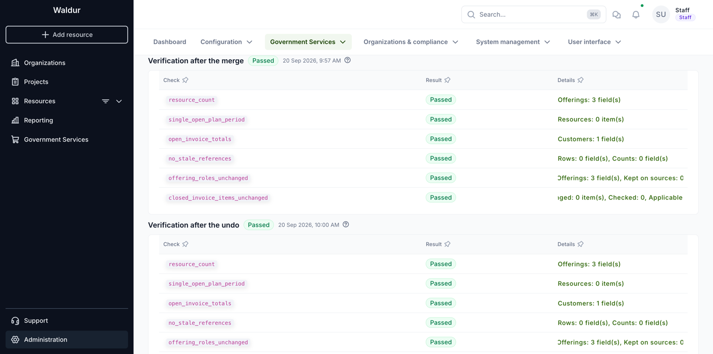

Each check is one row: its code, whether it passed, and a one-line summary of what it
compared. A merge that has been undone carries two reports, each under its own heading —
*Verification after the merge* and *Verification after the undo* — with the overall result
and the time it ran beside the heading.

| Check | What it asserts |
|-------|-----------------|
| `resource_count` | Each offering has exactly as many resources as expected: the sources lost them, the target gained them. |
| `single_open_plan_period` | No moved resource ended up with two open billing periods. |
| `open_invoice_totals` | Every affected customer's current invoice total is unchanged. |
| `no_stale_references` | No moved row still points at a source offering, plan, component or plan component. |
| `offering_roles_unchanged` | No offering's active role count changed; roles stay where they were. |
| `closed_invoice_items_unchanged` | Under the *Current open month* policy, no item on a closed invoice was touched. |

Opening a summary shows the check's details in full: the offerings it counted, the
customers whose invoice totals it compared, the rows it found. The payload differs per
check, so it is rendered by shape rather than by name — which is also why offerings and
customers appear as uuids there rather than as names — and the raw JSON stays available
under **Raw payload** for a bug report.

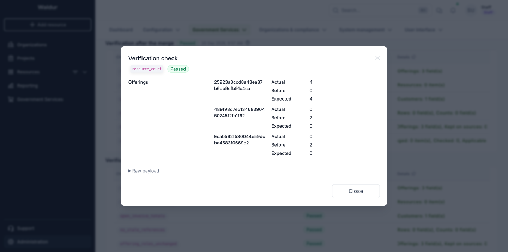

A failed check does not roll the merge back — the data has been written. Treat it as an
incident: open the merge record, read the failing check's details, and decide between
undoing the merge and correcting the rows by hand.

## After the merge

Confirm the outcome from the offerings themselves, not only from the report:

1. The source offerings are **Archived** and have no resources left.
2. The target offering lists all the moved resources, each on its mapped plan.
3. The current month's invoice for each affected customer has the same total as before.
4. Anything that stayed on the sources and should keep applying — terms of service,
   policies, announcements — exists on the target.

The merge record keeps the mappings, the preview and the verification reports, so it stays
readable as the record of what happened. The mappings are stored by uuid and shown by
name, so they keep saying which source plan and which source component ended up where even
after something is renamed.

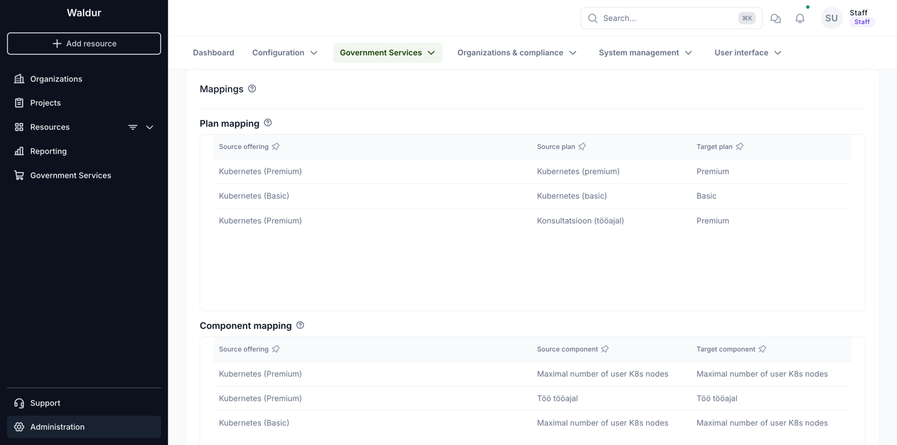

Support users see the same page, with the verification report and the preview, but without
the buttons that change anything:

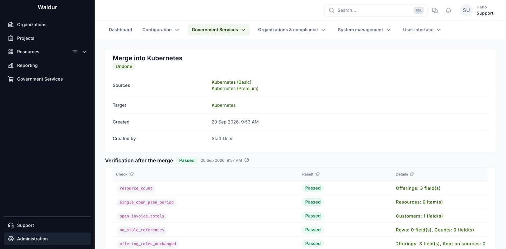

## Undoing a merge

A merge in state *Done* can be undone. Undo moves the resources, orders, usage and the
other rows back to their source offerings, restores their plans and components, unarchives
the sources, and puts the invoice items back as they were.

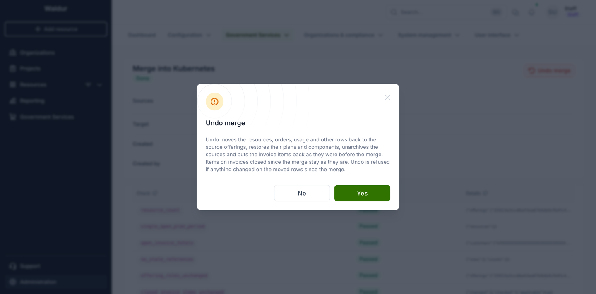

Rows created **after** the merge for the moved resources — new usage, quotas, orders,
invoice items — go back with them, as long as they can be mapped to something on the
source. Limit changes and usage reported since the merge survive: undo applies the inverse
renames to the current values rather than restoring old documents wholesale.

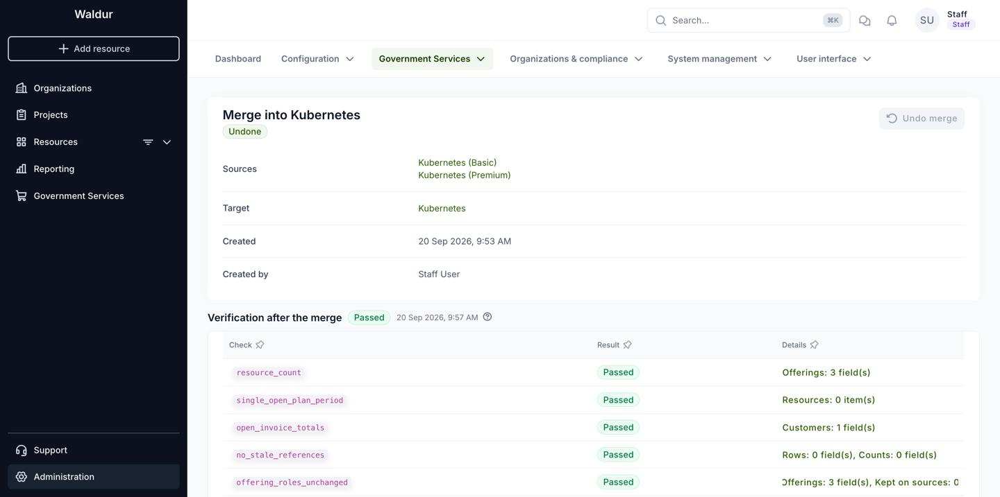

Once undone, the merge record stays as history and can no longer be undone again. Running
the same consolidation later means creating a new merge.

### When undo is refused

Undo checks its preconditions before it changes anything, and refuses without writing when
one of these holds:

| Code | What it means |
|------|---------------|
| `resource_changed` | A moved resource switched plan or offering after the merge. The named resources have to be put back on the target's mapped plan before undo can work. |
| `changed_since_merge` | A row the merge wrote no longer holds the value the merge gave it — something edited it afterwards. |
| `pending_orders` | A moved resource has a pending order. Approve, reject or cancel it first. |
| `unmappable_new_row` | A row created after the merge cannot go back: its component has no counterpart on the source, or an order uses a target plan the resource was not moved to. |
| `unique_conflict` | Moving rows back would violate a unique constraint — typically usage that exists on both sides for the same resource, component and period. |

A refusal leaves the merge in state *Done*, with the reason on the record: the merge is
still in effect and nothing was half-undone.

Some invoice items are skipped rather than restored: items deleted since the merge, items
whose rewritten values changed since, and — under the *Current open month* policy — items
whose invoice has been closed in the meantime, because restoring them would change an
issued invoice. No page lists them; they are recorded in the undo's verification report on
the merge, which is readable through the API.

## Worked example

A provider published two offerings for the same container platform: **Kubernetes (Basic)**,
with one plan, and **Kubernetes (Premium)**, with a plan for the service itself and a
second plan for consultancy hours. A third offering, **Kubernetes**, already exists with
two plans, *Basic* and *Premium*, and is the catalogue entry that should remain. Four
resources are in use across the two sources, all with usage and invoice items for the
current month.

1. **Prepare the target.** *Kubernetes* has both plans, with prices and components in
   place: the node-count component both sources use, and the working-hours component the
   consultancy plan uses.
2. **Select.** Sources: *Kubernetes (Basic)* and *Kubernetes (Premium)*. Target:
   *Kubernetes*. All three are of the same type, so nothing objects.
3. **Map.** *Kubernetes (basic)* → *Basic*. *Kubernetes (premium)* → *Premium*.
   *Konsultatsioon (tööajal)*, the consultancy plan, also → *Premium*: two source plans
   folding into one target plan is what consolidation looks like. The components map onto
   the target components of the same type.
4. **Answers.** The sources' order forms carry a handful of keys the target does not have.
   They are left as they are — the answers stay on the resources for the record.
5. **Invoice policy.** *Current open month*, so invoices already issued keep naming the
   offerings that were actually ordered.
6. **Preview.** Nothing blocks the merge. Two warnings appear: `plan_price_difference`,
   because the consultancy plan had no price for the node-count component while *Premium*
   charges for it, and `source_configuration_stays`, because the sources' terms of service
   remain behind — their plans and components stay too, but the warning is not about
   those. Both are acknowledged. *Resources and
   orders* shows four resources and their four plans moving, *Billing history* four billing
   periods and five usage records, *Invoices* five invoice lines rewritten in place; the
   sources' own plans, components and terms of service are listed under *What stays on the
   sources*.
7. **Run.** The merge finishes and all six verification checks pass: four resources on the
   target, none left on the sources, the affected customer's open invoice total unchanged.
8. **Check.** Both sources are archived; *Kubernetes* lists the four resources, two on
   *Basic* and two on *Premium*. The terms of service that stayed on the sources are
   re-created on the target.

Had the consultancy plan been left unmapped, the preview would have refused the merge with
`unmapped_plan`, because a resource is on that plan. Had the target been missing the
working-hours component, it would have refused with `unmapped_component`.
