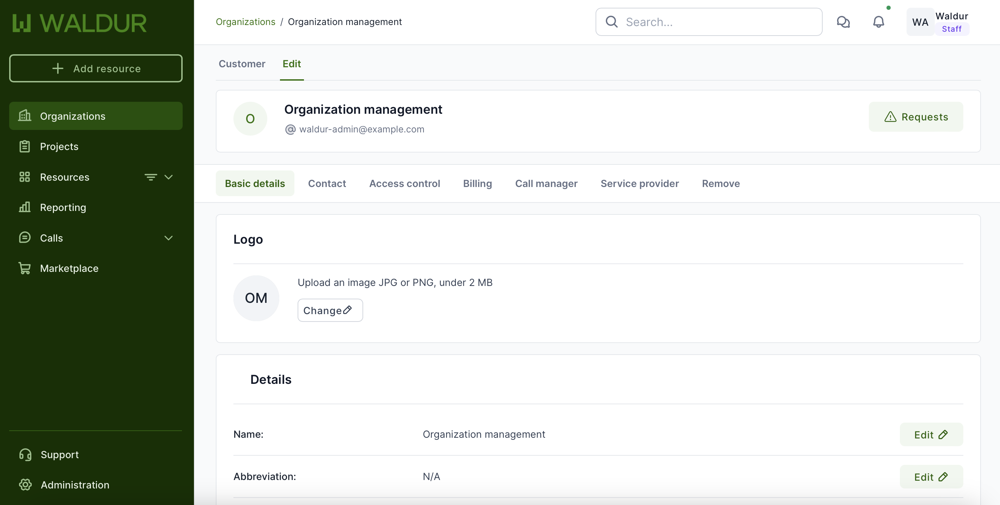
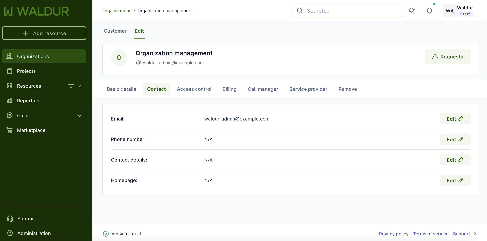
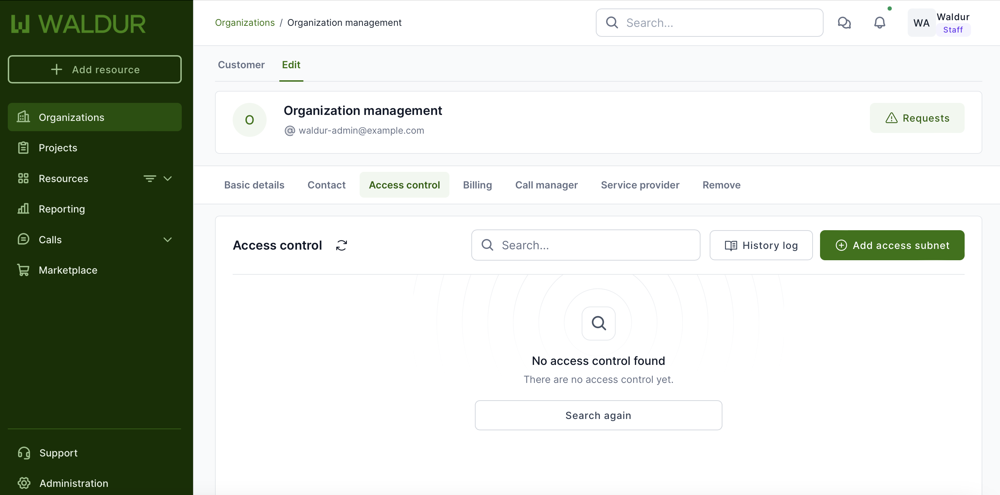
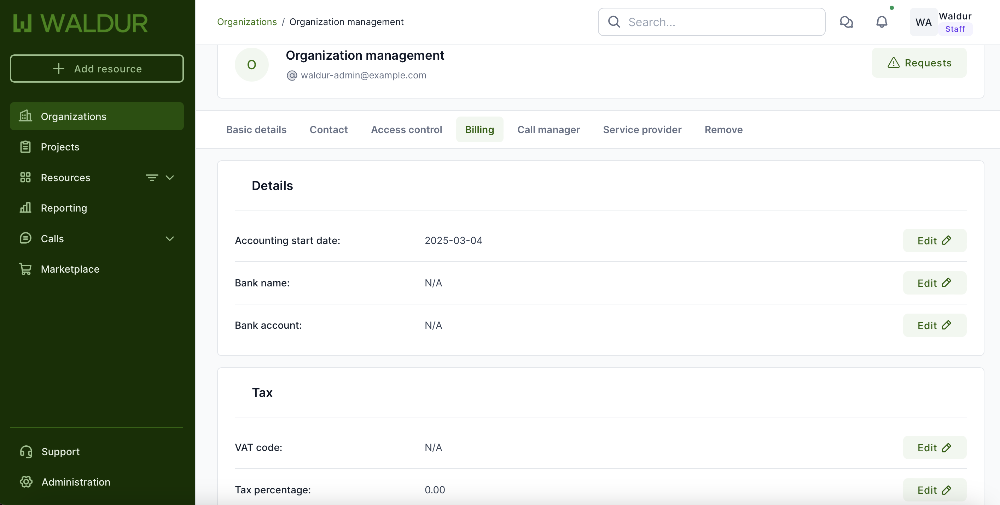
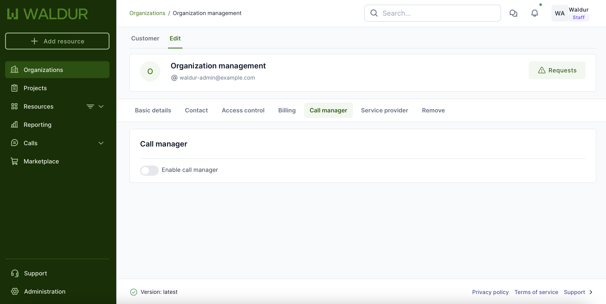
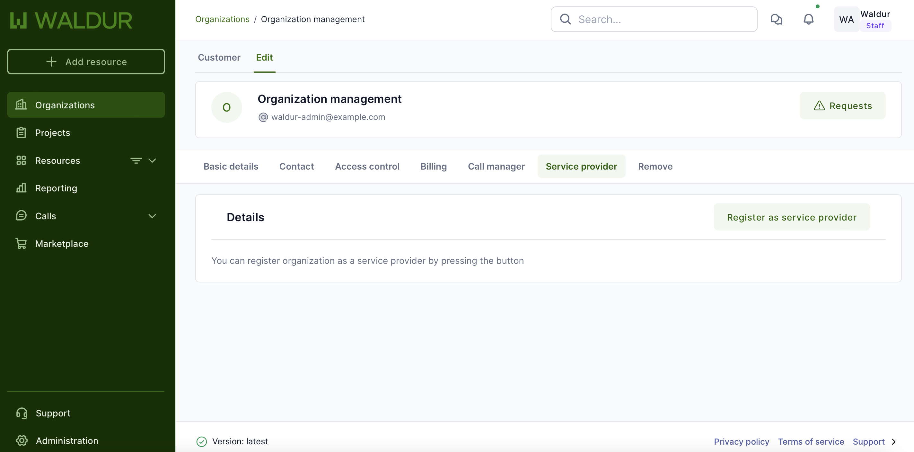

# Organization management

## Overview

In Waldur, an organization represents a configurable grouping unit that can be adapted to various contexts such as research groups, institutions, departments, or working groups. Each organization has an designated owner who manages the organization's projects, users, and associated resources.

## Create a new organization

!!! note
    Organization creation is only allowed for users in Staff role!

1. Login to Waldur and select "Organizations" from the left-side menu and then select "Add" from the right.
2. Fill the form and click "Create organization":

    - Name - Name of the organization
    - Contact email - email of the person, who is responsible for the organization

3. Organization edit page opens, where it is possible to add additional information, like policies, contact information. It is beneficial to assign a predefined category group (like private company, university, government, individial person etc) to organization.

!!! Note
    After the creation of the organization by the staff user, organization owners can manage organization details. To do this, navigate to the organization dashboard and select **Edit**.

## Organization configuration

The organization edit interface consists of six main tabs, each containing specific configuration options:

### Basic details

- **Name** - Full organization name
- **Abbreviation** - Short form of organization name
- **Address** - Physical location
- **Postal code** - Postal/ZIP code
- **Country** - Country of registration
- **Organization groups** - Associated group categories
- **Location** - Geographic location

### Identifiers

- **UUID** - System-generated unique identifier (non-editable)
- **Slug** - URL-friendly identifier (non-editable)
- **Registration code** - Official registration number
- **Agreement number** - Contract reference number
- **Sponsor number** - Sponsorship identifier

### Contact information

- **Email** - Primary contact email
- **Phone number** - Contact telephone
- **Contact details** - Additional contact information
- **Homepage** - Organization's website

### Access control

To configure network access restrictions add access subnets by specifying:

- **CIDR** - Network address range
- **Description** - Purpose or identifier for the subnet

### Billing

Contains billing-related configurations:

- Billing details
- Tax information

### Call manager

You can enable Call manager by enabling the radio button:

- **Enable call manager**

### Service provider

You can register organization as a service provider by pressing the button:

- **Register as service provider**

### Remove

Provides organization removal functionality:

- Click "Remove organization" button to delete the organization

!!! note
    Organization removal should be handled with caution as it may affect associated projects and users. Ensure all necessary data is backed up before proceeding with organization removal.
