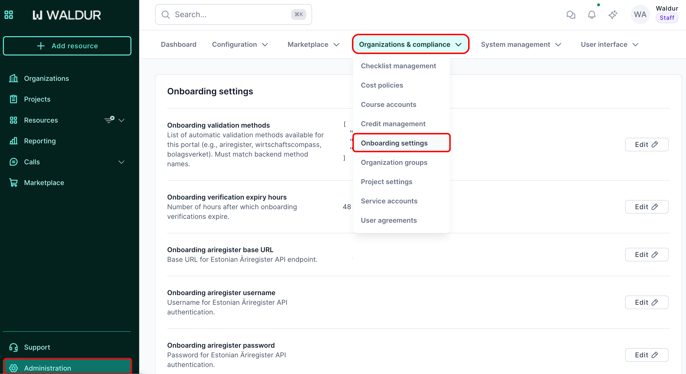
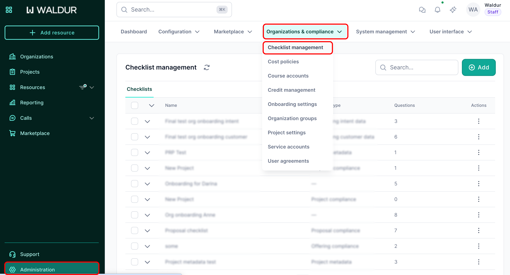
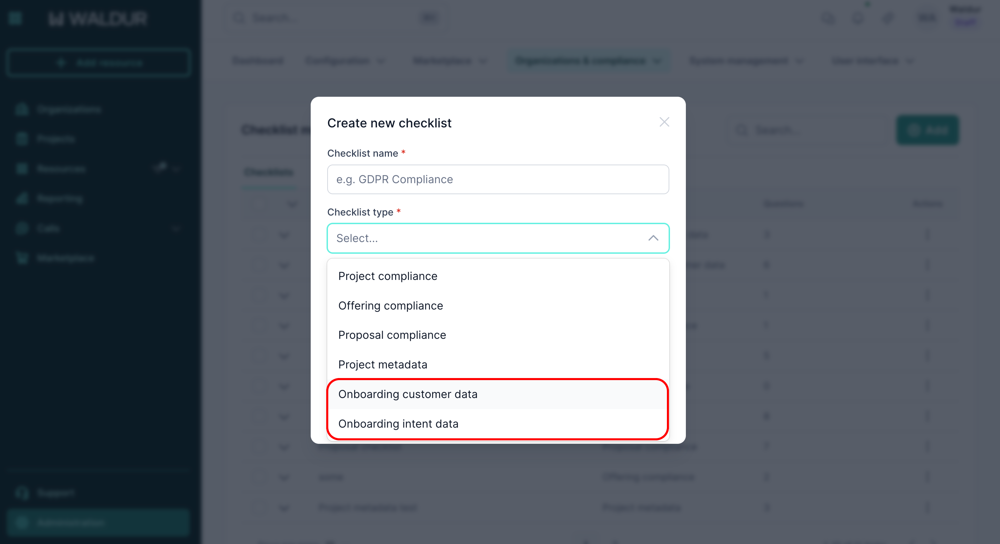
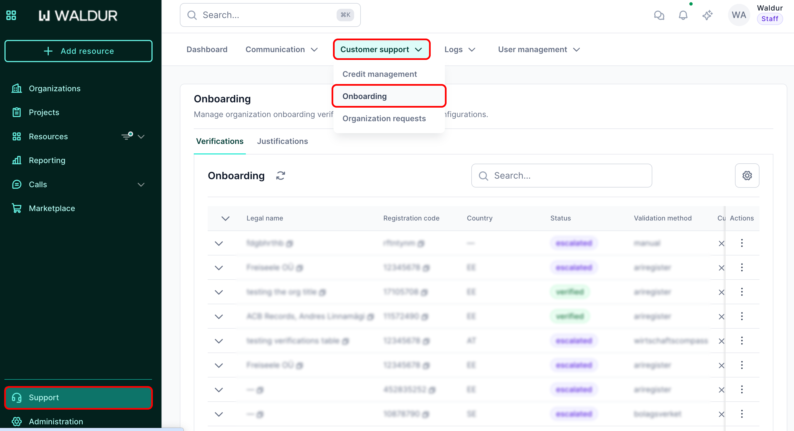

# Organization onboarding

This guide explains how administrators and staff users configure and manage organization onboarding in Waldur.

## Step 1: Configure onboarding settings

Before setting up onboarding checklists, configure the global onboarding settings.

**Navigation path:** Administration → **Organizations & compliance** → **Onboarding settings**

### Required configuration

- **Onboarding validation methods**  
    - Select the automatic validation methods enabled for your portal (for example: `ariregister`, `wirtschaftscompass`, `bolagsverket`).  
    - These values must match the backend validation method names.

- **Onboarding verification expiry hours**  
    - Define how long (in hours) an onboarding verification remains valid.

- **Registry API configuration**  
     - Configure base URLs, credentials, tokens, and timeouts for each supported business registry.

After providing all required values, click **Save**.

## Step 2: Configure organization onboarding checklists

Organization onboarding uses checklists to collect data from users. Two checklists are required:

- **Onboarding customer data**
- **Onboarding intent data**

**Navigation path:** Administration → **Organizations & compliance** → **Checklist management**

1. Create a new checklist or open the existing one.  
2. Set the **Checklist type**:
   - **Onboarding customer data** – for organization details.  
   - **Onboarding intent data** – for intent and purpose questions.  
3. Optionally, assign a description.

## Step 3: Configure onboarding questions

For each checklist, add or edit the questions presented to users.

### Question configuration

For every question:

1. Enter the **question text**.  
2. Select the **question type** (text, number, single select, multi‑select, etc.).  
3. Set the **question order**.  
4. Mark the question as **required**, if needed.  
5. Configure **visibility rules**, if applicable.  

### Field mapping (mandatory)

Each question must be mapped to the correct backend field.

**Example**

- **Question:** What is your purpose for registering an organization?  
- **Checklist type:** Onboarding intent data  
- **Field mapping:** `purpose`  

Correct field mapping ensures submitted data is stored and displayed correctly during review.

## Step 4: Review onboarding attempts

Organization onboarding attempts are reviewed by staff users.

**Navigation path:** Support → **Customer support** → **Onboarding**

### Verifications tab

The **Verifications** tab shows:

- All onboarding attempts  
- Automatically verified organizations  
- Validation status and method  

This view provides a high-level overview of all organization onboarding activity.

### Justifications tab

The **Justifications** tab shows manual onboarding attempts. Staff users can:

- Review submitted organization data  
- Review answers to onboarding questions  
- Download supporting documents  
- Add staff notes  
- Approve or reject applications  

Approving a justification allows the organization to be created in the system.

## Step 5: Outcome

- **Approved applications** result in organization creation.  
- **Rejected applications** remain visible with decision history for the next 30 days.  

All actions are auditable via onboarding records.