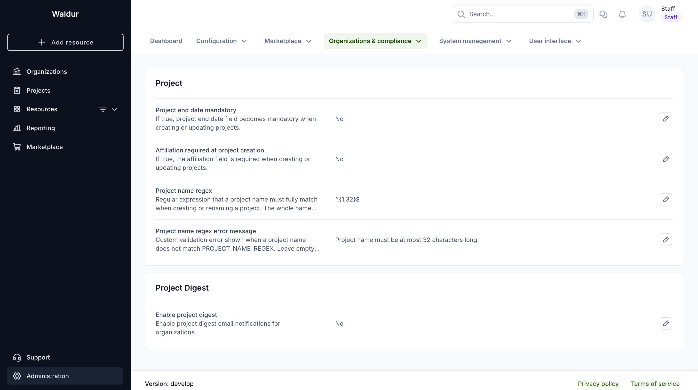
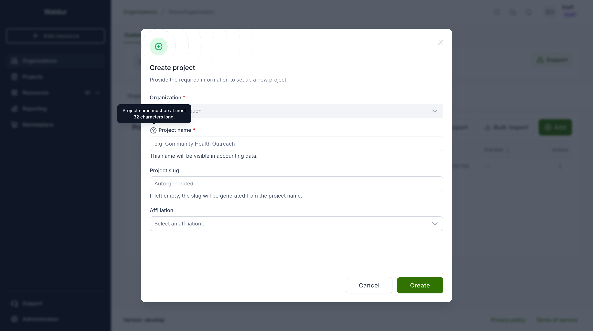
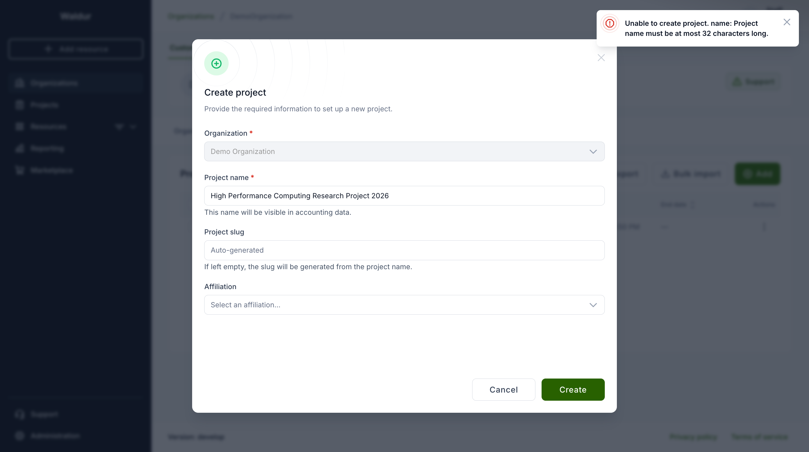

# Project name restrictions

Waldur can restrict the names users may give to projects, so that project names follow a naming convention — for example, a maximum length or a limited set of characters. The restriction is defined as a regular expression and applies across all organizations in the deployment.

The rule is checked whenever a user sets a project name: when creating a project, renaming it, entering a custom project name while accepting an invitation, or naming a proposal that becomes a project on approval. Automatically generated project names — for example those created by provisioning integrations or data imports — are not affected.

## Configuring the restriction

**Performed by:** Staff (instance administrator)

### Step 1: Open Administration settings

Navigate to **Administration** and select **Settings**.

### Step 2: Configure the Project settings

1. Open the **Project** section.
2. Set **Project name regex** to a regular expression that the whole project name must match. Leave it empty to allow any name.
3. Optionally, set **Project name regex error message** to a plain-language message shown to users when a name is rejected. If left empty, a default message is used.

## Examples

| Regular expression | Effect |
|---|---|
| `^.{1,32}$` | Name may be 1–32 characters long |
| `^[A-Za-z0-9 _-]{1,32}$` | 1–32 characters, limited to letters, digits, spaces, underscores and hyphens |
| `^[A-Za-z].{0,31}$` | Must start with a letter; up to 32 characters |

## How it works

- The whole name must match the pattern. An empty pattern disables the check, so any name is allowed.
- The rule is enforced only when the name is set or changed. Existing projects whose names predate the rule keep working, and editing their other fields is not blocked.
- When a restriction is set, the project create form shows it as a tooltip next to the **Project name** field, so users see the requirement before they submit.

- When a name is rejected, the user sees the **Project name regex error message** if one is configured, otherwise a default message.

!!! note
    If the configured regular expression is invalid, the check is skipped rather than blocking project creation. Test your pattern before relying on it.
