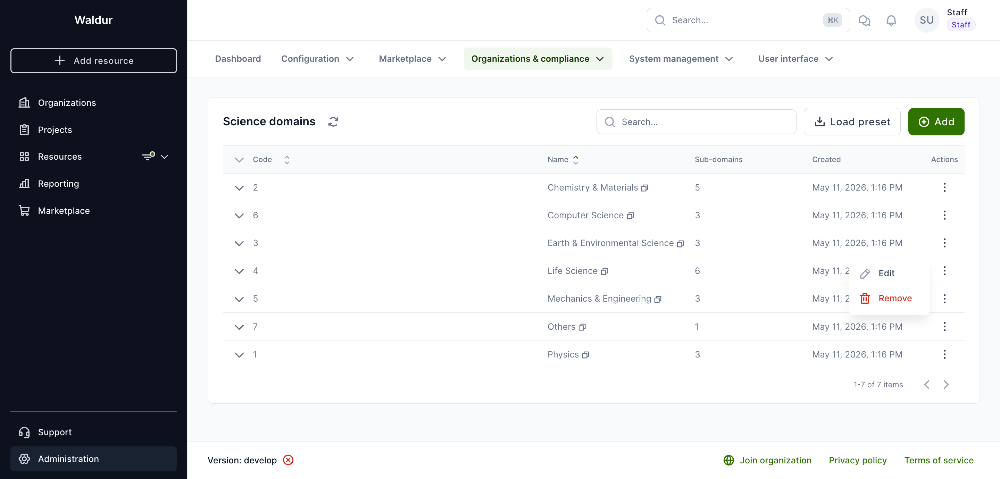
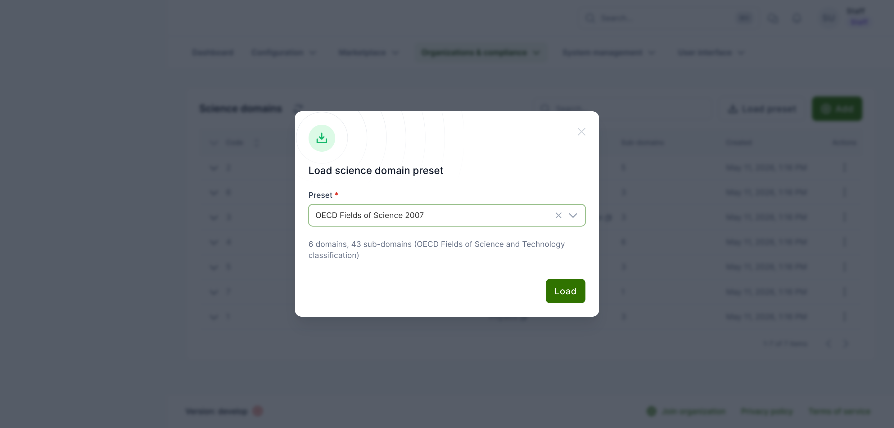
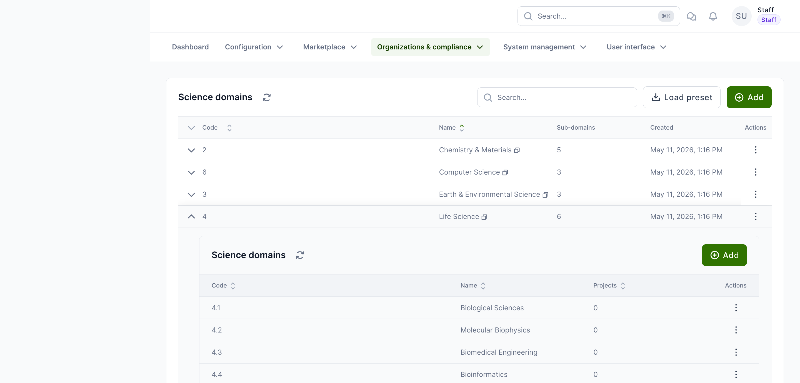

# Science domain management

Waldur lets staff define a two-level taxonomy of science **domains** and **sub-domains**. End users can tag their projects with one of them, which improves reporting and discoverability across the platform.

The end-user picker is only visible once the `project.science_domain` feature is enabled and at least one domain exists.

## Access

Open **Administration → Organizations & compliance → Science domains** (URL: `/administration/science-domains/`).

Each row shows the domain **Code**, **Name**, **Sub-domains** count and **Created** date. Use the row's three-dot menu to **Edit** or **Remove** a domain, and the chevron on the left of the row to manage its sub-domains.

## Loading a built-in preset

Click **Load preset** to seed the taxonomy from a curated list. Two presets are bundled:

- **CSCS Science Domains** — 7 domains, 24 sub-domains. Compact, HPC-oriented; a good fit for supercomputing centres and discipline-aligned compute deployments.
- **OECD Fields of Science 2007** — 6 domains, 43 sub-domains. Standard academic classification; recommended for national research infrastructures and broader academic portfolios.

Loading is idempotent — domains and sub-domains with codes that already exist are skipped, so it is safe to re-run. On success a notification reports how many entries were created vs skipped.

!!! tip
    Pick one preset that matches your audience and avoid mixing. Codes differ between presets and cannot be remapped automatically.

## Adding domains manually

1. Click **Add** in the top-right of the list.
2. Fill in **Code** (short identifier, e.g. `1`, `1.1`) and **Name**.
3. Click **Save**.

Repeat for each top-level domain you need.

## Managing sub-domains

Expand any row using the chevron on the left to reveal its sub-domains table. From there:

- **Add** — create a sub-domain under this domain. Provide **Code** and **Name**.
- The row's three-dot menu offers **Edit** and **Remove** actions.

The **Projects** column shows how many projects currently reference each sub-domain — useful before removal.

!!! warning
    Removing a sub-domain that is referenced by projects unsets the field on those projects. Reassign affected projects first when possible.

## Editing and removing domains

Use the row's three-dot menu for **Edit** (rename or change the code) and **Remove**. Removing a domain that still has sub-domains is blocked — delete or move its sub-domains first.

## Enabling the picker

Even after seeding domains, the end-user picker stays hidden until the `project.science_domain` feature flag is on:

1. Open **Administration → Configuration → Features**.
2. In the **Project** section, enable **Enable science domain/sub-domain selection for projects**.
3. Save and reload.

Once enabled, the picker appears in the project create dialog and on the project's metadata page (see the [customer guide](../customer-organization/project-management.md#science-domain) for the end-user view).
