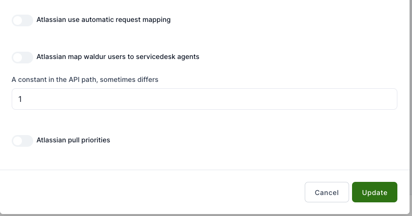

# Service desk configuration

Waldur offers a convenient way to integrate with popular service desk solutions like Atlassian, Zammad, and Smax. With this integration, you can manage service desk tickets directly within Waldur.

To set up the configuration, navigate to the Service Desk configuration page by going to **Administration** -> **Service Desk**.

* **Waldur support enabled** - Toggle **Yes** if you want to use support plugin.
* **Waldur support active backend type** - Select the active configuration.
* **Waldur support display request type** - Toggle to show the request type.

## Atlassian configuration

To configure Atlassian for Waldur, open the Service Desk configuration page and select **Configure** from the Atlassian box.

A popup will appear. Fill in the required fields and click **Update**.

* **Atlassian API server URL** – The base URL for connecting to the Atlassian API.
* **Username for access user** – The username of the account used for API authentication.
* **Password for access user** – The password for the access user (if required).
* **Email for access user** – The email address associated with the access user.
* **Token for access user** – An authentication token used instead of a password for secure access.
* **Service desk ID or key** – The identifier for the service desk in Jira Service Management.
* **Issue type used for request-based item processing** – Defines which issue type (e.g., "Service Request") is used for handling requests.
* **Comma-separated list of file extensions not allowed for attachment** – Specifies file types that cannot be uploaded.
* **Atlassian issue types** – Lists the types of issues available (e.g., Informational, Service Request, Change Request, Incident).
* **Affected resource field name** – The field name that captures the impacted resource.
* **Template for issue description** – A predefined format for issue descriptions.
* **Template for issue summary** – A predefined format for issue summaries.
* **Impact field name** – The field used to store impact-related information (e.g., "Impact").
* **Organisation field name** – Maps the field for the organization associated with the issue (e.g., "Reporter organization").
* **Resolution SLA field name** – Defines the field tracking SLA (Service Level Agreement) resolution time.
* **Project field name** – Stores the project identifier for an issue.
* **Reporter field name** – Identifies the original reporter of an issue (e.g., "Original Reporter").
* **Caller field name** – Refers to request participants (e.g., users involved in the request process).
* **SLA field name** – Specifies the field used for tracking SLA metrics (e.g., "Time to first response").
* **Type of linked issue field name** – Defines the field used to categorize linked issues (e.g., "Relates").
* **Customer satisfaction field name** – Captures customer satisfaction ratings (e.g., "Customer satisfaction").
* **Request feedback field name** – Stores feedback related to the request (e.g., "Request feedback").
* **Template field name** – Allows specifying a template for issue creation.
* **Atlassian custom issue field mapping enabled** – Allows enabling/disabling custom field mapping.
* **Atlassian shared username** – Enables a shared username across different configurations.
* **Atlassian verify SSL** – Controls whether SSL certificates should be verified for security.
* **Atlassian use old API** – Enables compatibility with older API versions.
* **Atlassian use automatic request mapping** – When enabled, this setting allows automatic mapping of incoming requests to the appropriate Atlassian issues or service desk requests.
* **Atlassian map Waldur users to service desk agents** – This suggests an integration between Waldur and Atlassian's service desk. Enabling this would map Waldur users to service desk agent roles.
* **Atlassian pull priorities** – If enabled, it allows the system to synchronize or pull priority levels from Atlassian issues to maintain consistent prioritization.

## Zammad configuration

To configure Zammad for Waldur, open the Service Desk configuration page and select **Configure** from the Zammad box.

A popup will appear. Fill in the required fields and click **Update**.

* **Zammad API server URL** - Zammad instance API URL.
* **Authorization token** - Zammad instance API token.
* **Zammad group** - Zammad instance group under which the tickets are created.
* **Zammad article type** - Zammad instance article type. Usually "email".
* **Zammad comment maker** - Additional comment line in Zammad, if the ticket is created in Waldur.
* **Comment prefix with user info** - Additional comment line in Zammad with user name, who created the ticket.
* **Zammad comment cooldown duration** - Time (in seconds) to remove the comment until it is saved in the system.

## Smax configuration

To configure Smax for Waldur, open the Service Desk configuration page and select **Configure** from the Smax box.

A popup will appear. Fill in the required fields and click **Update**.

* **SMAX API server URL** - Enter the URL of the SMAX API server to enable communication between Waldur and SMAX.
* **User tenant ID** - Provide the unique tenant ID associated with your SMAX user account.
* **Authorization login** - Enter the login credentials used to authenticate with the SMAX service.
* **Authorization password** - Enter the password associated with the authorization login.
* **Organisation field name** - Specify the field name that identifies the organization in SMAX.
* **Project field name** - Specify the field name used to identify the project in SMAX.
* **Resource field name** - Provide the field name used for identifying resources in SMAX.
* **Requests offering code for all issues** - Provide the offering code that corresponds to the issues in SMAX.
* **Duration in seconds of delay between pull user attempts** - Set the duration (in seconds) between attempts to pull user data from the backend.
* **The maximum number of attempts to pull user from backend** - Set the maximum number of attempts to pull user data from the backend before the process is stopped.
* **Creation source name** - Specify the source name used when creating tickets or records in SMAX.
* **Smax verify ssl** - Toggle this setting to enable or disable SSL verification when communicating with the SMAX server.

