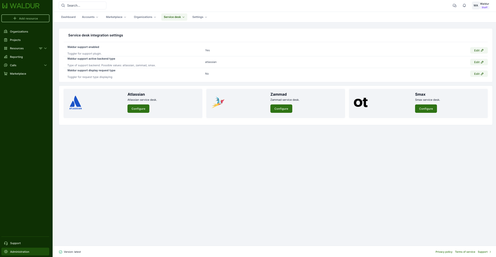
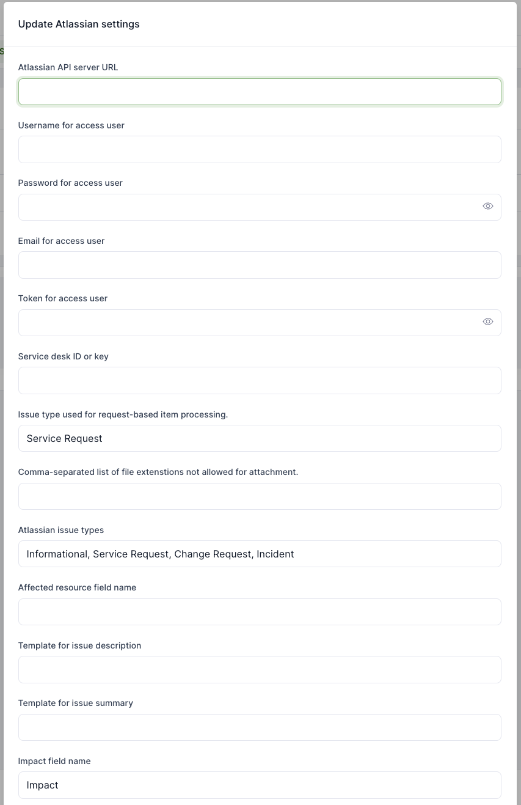
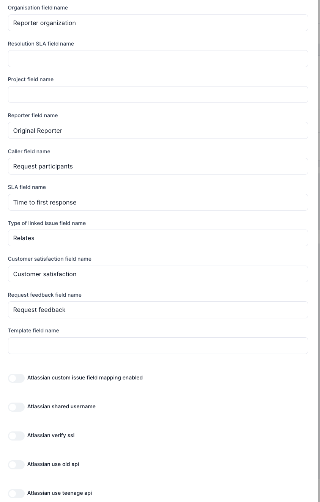
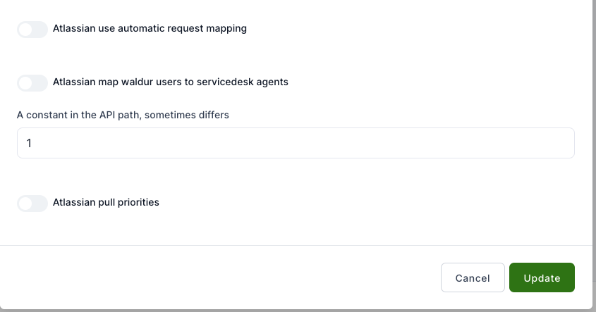
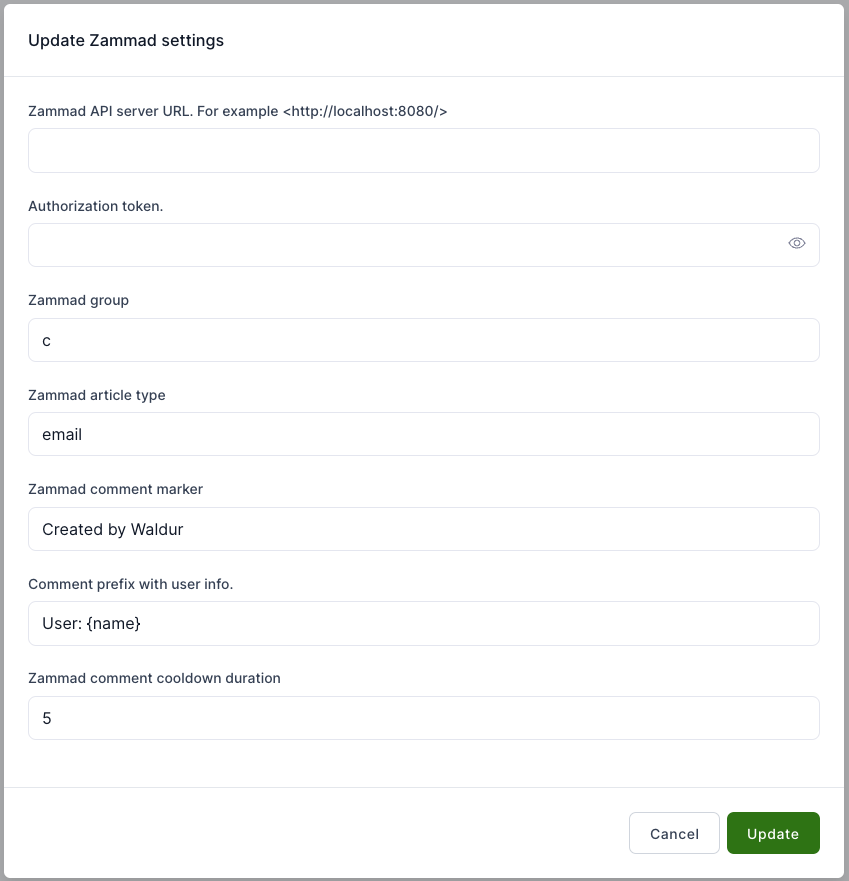
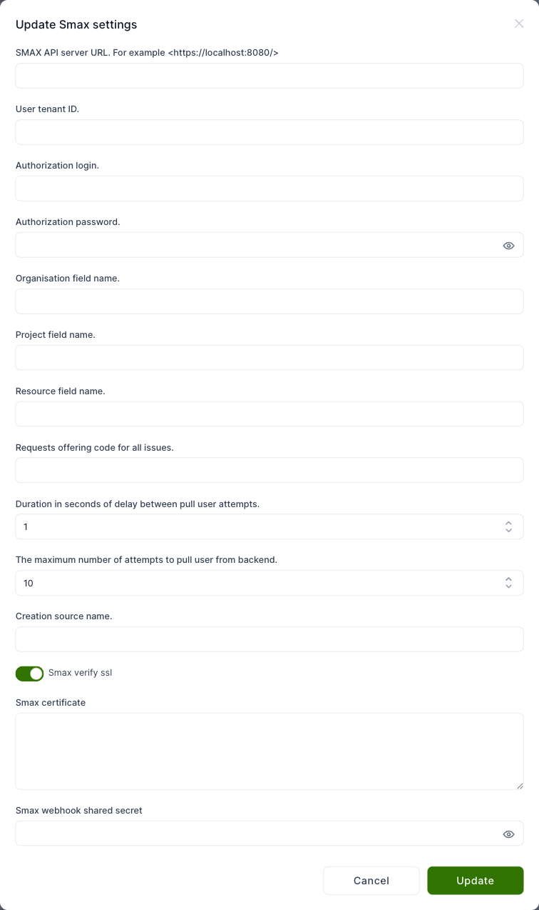

# Service desk configuration

Waldur offers a convenient way to integrate with popular service desk solutions like Atlassian, Zammad, and Smax. With this integration, you can manage service desk tickets directly within Waldur.

To set up the configuration, navigate to the Service Desk configuration page by going to **Administration** -> **Service Desk**.

* **Waldur support enabled** - Toggle **Yes** if you want to use support plugin.
* **Waldur support active backend type** - Select the active configuration.
* **Waldur support display request type** - Toggle to show the request type.

## Atlassian configuration

To configure Atlassian for Waldur, open the Service Desk configuration page and select **Configure** from the Atlassian box.

A popup will appear. Fill in the required fields and click **Update**.

* **Atlassian API server URL** – The base URL for connecting to the Atlassian API.
* **Username for access user** – The username of the account used for API authentication.
* **Password for access user** – The password for the access user (if required).
* **Email for access user** – The email address associated with the access user.
* **Token for access user** – An authentication token used instead of a password for secure access.
* **Service desk ID or key** – The identifier for the service desk in Jira Service Management.
* **Issue type used for request-based item processing** – Defines which issue type (e.g., "Service Request") is used for handling requests.
* **Comma-separated list of file extensions not allowed for attachment** – Specifies file types that cannot be uploaded.
* **Atlassian issue types** – Lists the types of issues available (e.g., Informational, Service Request, Change Request, Incident).
* **Affected resource field name** – The field name that captures the impacted resource.
* **Template for issue description** – A predefined format for issue descriptions.
* **Template for issue summary** – A predefined format for issue summaries.
* **Impact field name** – The field used to store impact-related information (e.g., "Impact").
* **Organisation field name** – Maps the field for the organization associated with the issue (e.g., "Reporter organization").
* **Resolution SLA field name** – Defines the field tracking SLA (Service Level Agreement) resolution time.
* **Project field name** – Stores the project identifier for an issue.
* **Reporter field name** – Identifies the original reporter of an issue (e.g., "Original Reporter").
* **Caller field name** – Refers to request participants (e.g., users involved in the request process).
* **SLA field name** – Specifies the field used for tracking SLA metrics (e.g., "Time to first response").
* **Type of linked issue field name** – Defines the field used to categorize linked issues (e.g., "Relates").
* **Customer satisfaction field name** – Captures customer satisfaction ratings (e.g., "Customer satisfaction").
* **Request feedback field name** – Stores feedback related to the request (e.g., "Request feedback").
* **Template field name** – Allows specifying a template for issue creation.
* **Atlassian custom issue field mapping enabled** – Allows enabling/disabling custom field mapping.
* **Atlassian shared username** – Enables a shared username across different configurations.
* **Atlassian verify SSL** – Controls whether SSL certificates should be verified for security.
* **Atlassian use old API** – Enables compatibility with older API versions.
* **Atlassian use automatic request mapping** – When enabled, this setting allows automatic mapping of incoming requests to the appropriate Atlassian issues or service desk requests.
* **Atlassian map Waldur users to service desk agents** – This suggests an integration between Waldur and Atlassian's service desk. Enabling this would map Waldur users to service desk agent roles.
* **Atlassian pull priorities** – If enabled, it allows the system to synchronize or pull priority levels from Atlassian issues to maintain consistent prioritization.

## Zammad configuration

To configure Zammad for Waldur, open the Service Desk configuration page and select **Configure** from the Zammad box.

A popup will appear. Fill in the required fields and click **Update**.

* **Zammad API server URL** - Zammad instance API URL.
* **Authorization token** - Zammad instance API token.
* **Zammad group** - Zammad instance group under which the tickets are created.
* **Zammad article type** - Zammad instance article type. Usually "email".
* **Zammad comment maker** - Additional comment line in Zammad, if the ticket is created in Waldur.
* **Comment prefix with user info** - Additional comment line in Zammad with user name, who created the ticket.
* **Zammad comment cooldown duration** - Time (in seconds) to remove the comment until it is saved in the system.

## Smax configuration

To configure Smax for Waldur, open the Service Desk configuration page and select **Configure** from the Smax box.

A popup will appear. Fill in the required fields and click **Update**.

* **SMAX API server URL** - Enter the URL of the SMAX API server to enable communication between Waldur and SMAX.
* **User tenant ID** - Provide the unique tenant ID associated with your SMAX user account.
* **Authorization login** - Enter the login credentials used to authenticate with the SMAX service.
* **Authorization password** - Enter the password associated with the authorization login.
* **Organisation field name** - Specify the field name that identifies the organization in SMAX.
* **Project field name** - Specify the field name used to identify the project in SMAX.
* **Resource field name** - Provide the field name used for identifying resources in SMAX.
* **Requests offering code for all issues** - Provide the offering code that corresponds to the issues in SMAX.
* **Duration in seconds of delay between pull user attempts** - Set the duration (in seconds) between attempts to pull user data from the backend.
* **The maximum number of attempts to pull user from backend** - Set the maximum number of attempts to pull user data from the backend before the process is stopped.
* **Creation source name** - Specify the source name used when creating tickets or records in SMAX.
* **Smax verify ssl** - Toggle this setting to enable or disable SSL verification when communicating with the SMAX server.
* **Smax certificate** - Optionally provide a custom CA certificate (PEM format) used to validate the TLS connection to the SMAX server. When set, it overrides the default CA bundle. This is useful when SMAX is hosted internally with a corporate or self-signed CA. The certificate is ignored if SSL verification is disabled.
* **Smax webhook shared secret** - Shared secret expected in the `X-Webhook-Secret` header of inbound SMAX webhook deliveries. If left empty, webhook authentication is not enforced.

## Synchronising changes back to Waldur (webhooks)

The configuration above lets Waldur **push** tickets to the service desk and poll for updates. To make changes that happen **inside** the service desk (status transitions, new agent comments, resolution) appear in Waldur in near real time, configure an outbound webhook in the service desk system that calls back to Waldur whenever a ticket changes.

Without a webhook, Waldur only learns about changes during the periodic background synchronisation, so updates made in the service desk can be delayed.

### How it works

Each backend exposes a dedicated, unauthenticated receiver endpoint on the Waldur API. When the service desk fires a webhook, Waldur looks up the local issue by the backend ticket ID carried in the payload and re-synchronises that single issue — pulling the latest status and comments, and updating the linked order's output where applicable.

| Backend | Webhook endpoint (relative to the Waldur API host) | Ticket identifier expected in the payload |
|---------|-----------------------------------------------------|-------------------------------------------|
| Zammad | `/api/support-zammad-webhook/` | `ticket.id` (Zammad ticket ID) |
| Atlassian | `/api/support-jira-webhook/` | `issue.key` (Jira issue key) |
| SMAX | `/api/support-smax-webhook/` | `id` (SMAX request/entity ID) |

So, for an instance served at `https://waldur.example.com`, the Zammad callback URL is `https://waldur.example.com/api/support-zammad-webhook/`.

### Securing the webhook

The receiver endpoints are not protected by the normal Waldur authentication, so anyone who knows the URL could post to them. To prevent this, set a **webhook shared secret** in the corresponding service desk configuration (for example **Zammad webhook shared secret**). Waldur then expects the same value in an `X-Webhook-Secret` HTTP header on every inbound delivery:

* If the shared secret is **empty**, Waldur accepts unauthenticated requests (legacy behaviour).
* If the shared secret is **set**, Waldur rejects any request that does not carry a matching `X-Webhook-Secret` header with `403 Forbidden`.

!!! warning
    Because the endpoints are unauthenticated by default, securing them is strongly recommended for any production deployment. Treat the secret like a password and serve Waldur over HTTPS so the header is not exposed in transit.

### Zammad configuration

Zammad sends webhooks via a **webhook** definition that is invoked by a **trigger** (or scheduler). The steps below follow the [Zammad webhook documentation](https://admin-docs.zammad.org/en/latest/manage/webhook/add.html).

1. **Create the webhook in Zammad.** Open the Zammad admin panel and go to **Manage → Webhook → New Webhook**. Configure:
    * **Name** — for example `Waldur sync`.
    * **Endpoint** — `https://<your-waldur-host>/api/support-zammad-webhook/`.
    * **Request method** — `POST`.
    * **SSL verification** — keep enabled (disable only for self-signed certificates in test setups).

    Leave the **Custom Payload** toggle off. Zammad's [default payload](https://admin-docs.zammad.org/en/latest/manage/webhook/payload.html) already includes the `ticket` object with its `id`, which is the only field Waldur needs to identify the issue.

2. **Invoke the webhook from a trigger.** A webhook does nothing on its own — go to **Manage → Trigger → New Trigger**, set the conditions that should propagate to Waldur (for example *Action is updated* on tickets in the group used for Waldur), and under **Perform Changes** add a **Webhook** action pointing at the webhook created above.

3. **Match the issue.** Waldur reads `ticket.id` from the payload and looks up the local issue whose backend ID equals that value, then re-synchronises its status and comments.

!!! warning
    Zammad's webhook configuration does **not** support arbitrary custom HTTP headers — it only offers HTTP Basic authentication, a Bearer token, or an HMAC-SHA1 signature, none of which set the `X-Webhook-Secret` header that Waldur checks. To enforce the **Zammad webhook shared secret**, inject the `X-Webhook-Secret` header in a reverse proxy in front of Waldur (e.g. Nginx `proxy_set_header X-Webhook-Secret <secret>;` on the webhook location). If you cannot inject the header, leave the shared secret empty and restrict access to the endpoint by network controls instead.

### Atlassian configuration

1. In Waldur, set a value in the **JIRA webhook shared secret** field of the Atlassian configuration and save.
2. In Jira / Jira Service Management, create a webhook (or an automation rule with a *Send web request* action) that fires on issue and comment events.
3. Point it at `https://<your-waldur-host>/api/support-jira-webhook/` using the `POST` method, sending the standard Jira webhook JSON payload (it already includes `webhookEvent` and the `issue` object with its `key`).
4. Add an `X-Webhook-Secret` header matching the configured shared secret.

### SMAX configuration

1. In Waldur, set a value in the **Smax webhook shared secret** field of the SMAX configuration and save.
2. In SMAX, create an outbound webhook / notification rule that triggers when a request relevant to Waldur changes (for example on status change or new comment).
3. Point the webhook at `https://<your-waldur-host>/api/support-smax-webhook/` using the `POST` method, with a JSON body carrying the request's identifier in the `id` field (matching the SMAX entity ID Waldur stored when it created the ticket).
4. Add an `X-Webhook-Secret` header matching the configured shared secret.
