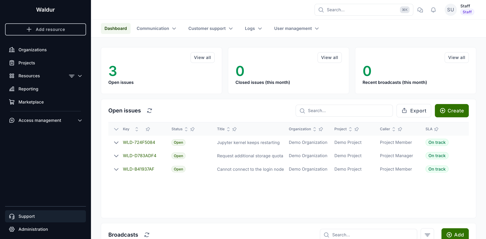
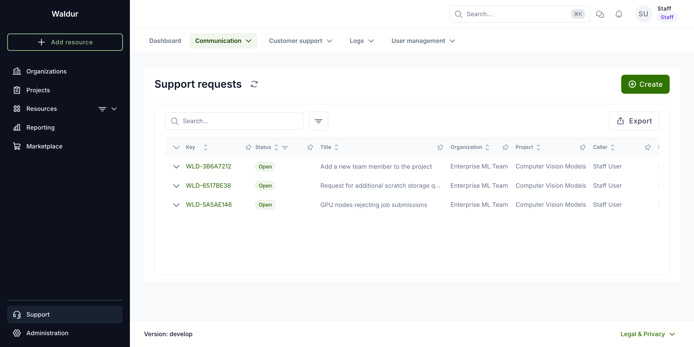
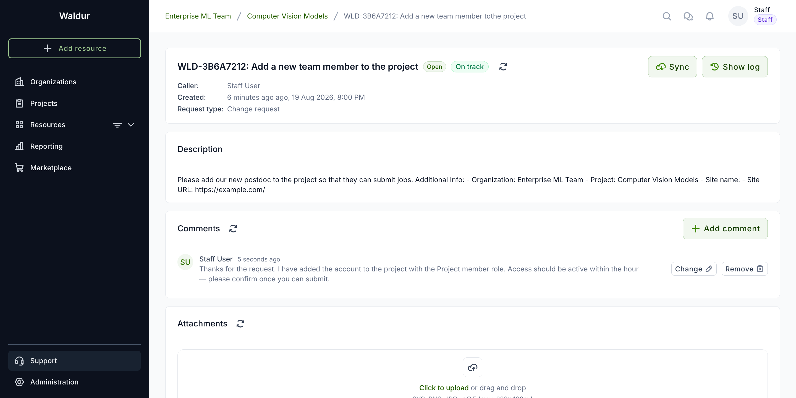
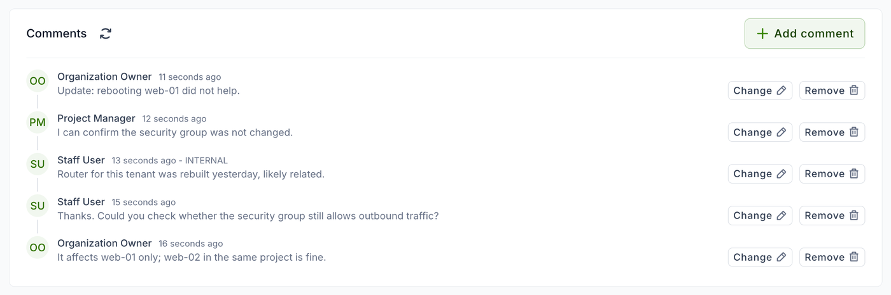
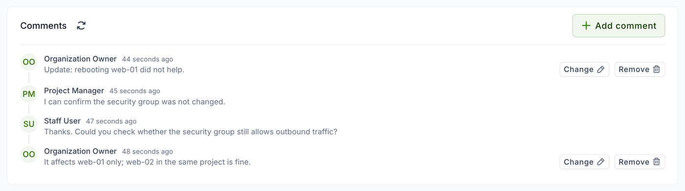
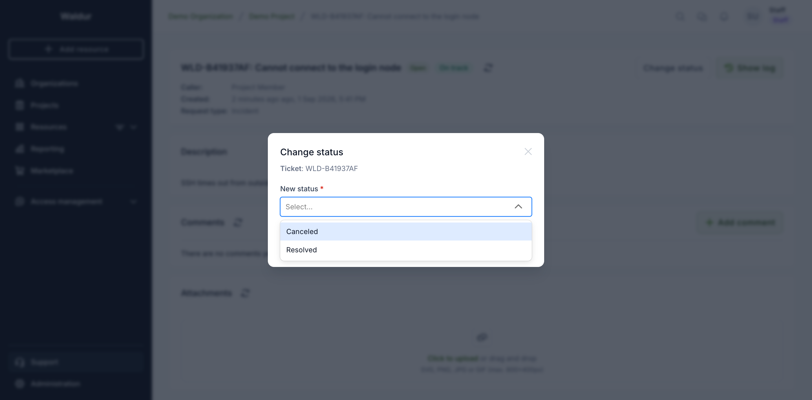
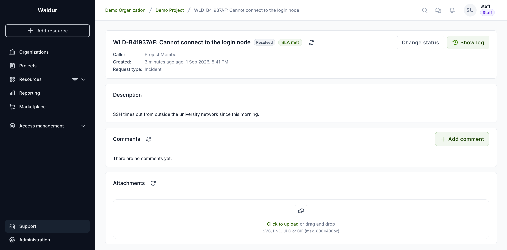

# Service desk interactions

This guide will help you navigate and effectively use the support system to manage service requests, track tickets, and communicate with users.

## Support dashboard

Open **Support → Dashboard** for an overview of the workload: how many tickets are still open, how many were closed this month, and the open ones listed below. Each counter links to the matching list.

A ticket counts as open until it reaches a status mapped to an outcome — see [which statuses close a ticket](service-desk-config.md#which-statuses-close-a-ticket).

## Accessing the service desk support tickets

Open **Support → Communication → Support requests**.

A page will open displaying all created tickets. You can view:

* The status of each ticket.
* The user name and organization that created the ticket.

To open a specific ticket, click on its key-name. This will open a dedicated ticket page.

On this page, you can:

* Read the content of the ticket.
* Check attachments.
* Add comments/replies to communicate with users.
* Change the ticket's status, when Waldur runs the service desk itself.

## Editing and deleting comments

Staff can edit or delete any comment on a ticket, including internal ones, with **Change** and **Remove** next to the comment. Editing changes only the text: an internal comment stays internal, and only staff can change whether a comment is public.

Users can edit and remove their own comments too, but only when Waldur runs the service desk itself, while the ticket is open, and as long as the ticket has not been routed to a provider helpdesk. They never see the buttons on other people's comments.

The buttons appear only where the action is possible. On a closed ticket, for example, they are gone for everyone.

!!! note
    With the Atlassian, Zammad or Smax backends the comment has already reached the external service desk, so users cannot change it from Waldur. Changes made by staff to a ticket routed to a provider helpdesk stay in Waldur: the provider keeps its copy of the original comment.

When the person who raised a ticket edits one of their comments, the assignee — or every staff and support user while the ticket is unassigned — can be emailed the previous and the edited text. This notification, `support.notification_comment_updated_staff`, is off until an administrator enables it; see [notifications](../../../admin-guide/mastermind-configuration/notifications.md).

## Changing the status of a ticket

Select **Change status** and pick the new status.

The list offers only the statuses this ticket may move to. If your deployment defines a workflow, that is what constrains the list; otherwise every configured status is available.

Once the ticket reaches a closing status it stops counting as open, and its SLA badge settles to **SLA met**.

Reopening works the same way — pick **Open** from the same menu, and the ticket returns to the open list with its SLA tracking again.

!!! note
    **Change status** appears only where Waldur owns the ticket's lifecycle. With the Atlassian, Zammad or Smax backends the external service desk is the source of truth, so change the status there and Waldur will pick it up. The same applies to a ticket routed to a provider helpdesk: its status belongs to that provider.
