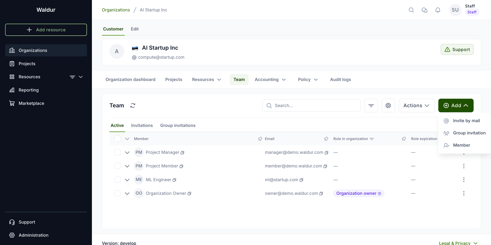

# Team management for staff

## Adding organization members

### New user already has account in current Waldur instance

1. Open the organization in Waldur.
2. Select **Team** from the menu. The organization's members are listed under the **Active**
   tab, alongside **Invitations** and **Group invitations**.
3. Click **Add** and choose **Member** to open the **Add member** dialog.  

      

4. Select correct user, set the role and expiration date if necessary.  

      

5. Finally, click **Add role**.
6. User now will be added to the organization.  
