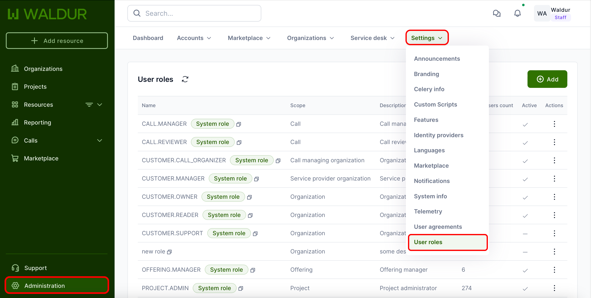

# User role management

## Overview

Staff users can manage user roles through the platform's role management interface. This includes configuring existing roles, creating new ones, and adjusting role permissions to ensure appropriate access levels across different organizational contexts.

## Accessing role management

1. Navigate to **Administration** in the main menu
2. Select **Settings**
3. Click on **User roles**

## Managing existing roles

### Viewing roles

The roles interface displays all existing roles with their associated types and descriptions.

### Role actions

For each role, administrators can:

1. **Edit role**
   - Modify role name
   - Change role type
   - Adjust permissions

2. **Edit description**
   - Update role description
   - Add clarifying information

3. **Disable role**
   - Temporarily deactivate role
   - Prevent new assignments

## Creating new roles

1. Click **Add new role**
2. Complete the required fields:
   - **Name** - Descriptive title for the role
   - **Type** - Select role context
   - **Permissions** - Configure permissions

### Available role types

- Organization
- Project
- Offering
- Call
- Proposal
- Service provider organization
- Call managing organization

## Permission configuration

Permissions in Waldur are extensively categorized to provide granular access control across different functional areas. Each permission category contains multiple specific actions that can be enabled or disabled.

### Offering permissions

- Controls the complete lifecycle of offerings
- Includes creation, modification, and deletion capabilities
- Manages offering components like endpoints, screenshots, and plans
- Controls offering states (pause/unpause/archive)
- Manages offering-specific user groups and campaigns
- Configures offering attributes, location, and description

### Order permissions

- Manages the order workflow process
- Controls order visibility and listing
- Handles order approval processes (both public and private)
- Manages order cancellation and rejection
- Controls order destruction capabilities

### Provider actions

- Manages service provider operations
- Controls resource management and reporting
- Handles API and robot account management
- Provides access to service provider statistics and revenue
- Manages provider-customer relationships
- Controls backend integration settings

### Customer actions for resources

- Controls resource visibility and management
- Handles resource lifecycle operations
- Manages booking requests and plan switching
- Controls resource limitations and options
- Manages importable resources

### Team member permissions

- Controls invitation management
- Manages permission assignments across projects, customers, and offerings
- Handles creation, updating, and deletion of various permission types
- Controls access level modifications

### Project permissions

- Manages project lifecycle
- Controls project creation and modification
- Handles project listing and deletion
- Sets project-level access controls

### Call management

- Controls call and round management
- Handles proposal workflows
- Manages permission assignments for calls
- Controls proposal approval processes
- Manages round closures
